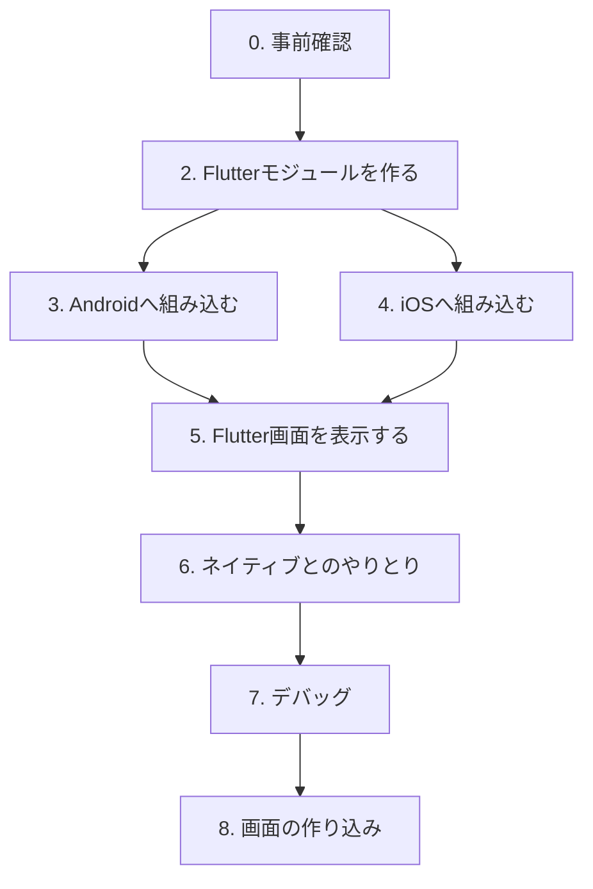
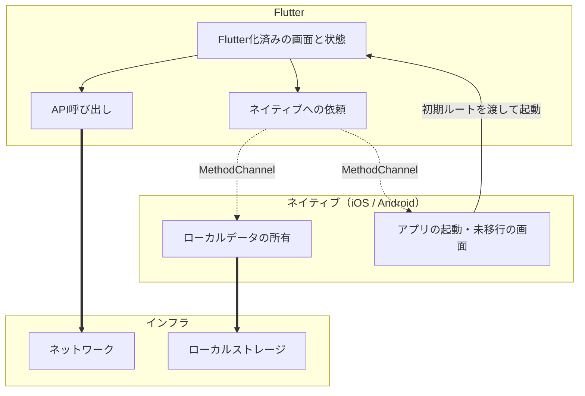

# 移行手順

既存のネイティブアプリ（Android / iOS）にFlutterを組み込み、画面単位で
移行していくための手順書（add-to-app）。

- 対象: 既存アプリにFlutterを初めて組み込む担当者
- 前提知識: 各プラットフォームの通常のビルド手順
- プロジェクト固有の内容は含まない

| 資料 | 内容 |
|---|---|
| `MIGRATION_GUIDE.md` | **移行の手順**。条件・手順・確認方法。プロジェクトに依存しない |
| `MIGRATION_PLAN_TEMPLATE.md` | **移行の計画**。アーキテクチャ・役割分担など、移行前に決めること。画面ごとに1部 |

**この資料には手順だけを書く。** 何を選んだかは計画側に残す。

このリポジトリで実際に手順をなぞった記録は `WORK_LOG.md` にある。手順に誤りや
不足が見つかった場合はこのファイルを更新する。

---

## 0. 事前確認

### 0.1 前提となる制約

組み込み方式を決める前に確認する。満たせない場合は計画そのものが変わる。

| 制約 | 内容 |
|---|---|
| Flutterモジュールは1アプリに1つ | 複数のFlutterライブラリを1つのアプリに組み込むことはできない。画面ごとにモジュールを分ける構成は取れない |
| Flutter画面ごとにエンジンが要る | 1つのDartプログラムから複数のFlutter画面を同時に出す方式はWeb専用。モバイルでは画面ごとに独立したエンジンを持つ（5.1節） |
| AndroidXが必須 | Androidホストアプリは AndroidX 化されていること |
| 対応ABI | Androidは x86_64 / armeabi-v7a / arm64-v8a のみ |
| プラグインの互換性 | `FlutterPlugin` インターフェースに対応していること。`FlutterActivity` が常に存在する前提で書かれたプラグインは動作しない場合がある |

### 0.2 バージョン要件

**Flutter SDK のバージョンが、ホストアプリのビルドツールに要求する下限を
決める。** 要求値はFlutter SDKの更新で変わるため、着手時に手元の環境で確認する。

以下は Flutter 3.47.1 における値。

| 対象 | 要件 | 確認コマンド | 期待する結果 |
|---|---|---|---|
| Flutter SDK | iOSでSPM方式を使う場合 3.44 以上 | `flutter build --help` | 一覧に `swift-package` がある |
| Android: Gradle | 8.14 以上 | `./gradlew -version` | `Gradle 8.14` 以上 |
| Android: Android Gradle Plugin | 8.11.1 以上 | ルートの `build.gradle` の `classpath 'com.android.tools.build:gradle:...'` | `8.11.1` 以上 |
| Android: Gradleを動かすJDK | 17 以上 | `./gradlew -version` | `Launcher JVM` が `17` 以上 |
| Android: AndroidX | 必須 | `grep useAndroidX gradle.properties` | `android.useAndroidX=true` |
| iOS: Xcode | 15.0 以上 | `xcodebuild -version` | `Xcode 15.0` 以上 |
| iOS: Deployment Target | 15.0 以上 | 下記 | ホストアプリの設定値がこれ以上 |

**iOSのDeployment Targetは、Flutterが生成するSwiftパッケージが宣言する。**
古いアプリでは最初に効く条件になるため、着手前に確認する。

```bash
grep -A2 "platforms" my_flutter_module/build/ios/SwiftPackages/FlutterNativeIntegration/Package.swift
# .iOS("15.0")
```

ホストアプリ側が下回っていると、パッケージ解決の時点で失敗する。引き上げられない
場合は、対応する下限が低い古いFlutterを使うか、対応OSを切る判断が要る。

#### Flutter SDKのバージョンを揃える

**バージョン管理下には、SDKのバージョンを固定するものが既定では何も無い。**
`.metadata` はツール用の記録で、固定には使えない。

**条件**: `source module` 方式では、ホストアプリをビルドする全員のマシンに
Flutter SDKが必要になる。揃える対象はFlutterを書く人だけではない。

**対処**: バージョンマネージャ（FVMなど）で固定し、設定ファイルをコミットする。

```bash
brew install fvm
cd my_flutter_module && fvm use <version>   # .fvmrc ができる
```

`.fvmrc` をコミットし、SDKの実体（`.fvm/`）は除外する。以降は `fvm flutter` で
実行する。あわせて `pubspec.yaml` に下限を宣言しておくと、FVMを使っていない人が
古いSDKで `pub get` した時点で止まる。

```yaml
environment:
  flutter: ">=<version>"
```

**確認**: ネイティブ側のビルドは**PATH上の `flutter` を見ていない。**
`flutter pub get` と `flutter build swift-package` を**実行したSDK**が、生成物に
絶対パスで焼き込まれる。

| OS | 焼き込まれる先 | 生成するコマンド |
|---|---|---|
| Android | `.android/local.properties` の `flutter.sdk` | `flutter pub get` |
| iOS（SPM） | `build/ios/SwiftPackages/` 一式 | `flutter build swift-package` |

```bash
grep flutter.sdk my_flutter_module/.android/local.properties
```

素の `flutter` でこれらを実行すると個人のSDKに書き戻るが、**ビルドは通るため
気づかない。** SDKを切り替えたら必ず両方を実行し直す。

満たさない場合、Flutter Gradleプラグインが下限を明示したエラーを出す。

```
> Error: Your project's Gradle version (8.9.0) is lower than Flutter's
  minimum supported version of 8.14.0. Please upgrade your Gradle version.
```

**JDKの要件はホストアプリの `compileOptions` とは別物。** `compileOptions` が
`VERSION_1_8` のままでもビルドは通る。要件を満たす必要があるのは
`./gradlew -version` が表示する `Launcher JVM`。

**AndroidX は AGP 8 でも自動的には有効にならない。** `android.useAndroidX` の
既定値は `false` のままで、明示的な設定が必要。ただし AGP 8 は AndroidX 依存が
あるのに無効な場合に必ずビルドを失敗させるため、**AGP 8 でビルドが通っていれば
要件は満たされている**と判断できる。

```
> Configuration `:app:debugRuntimeClasspath` contains AndroidX dependencies,
  but the `android.useAndroidX` property is not enabled, which may cause
  runtime issues.
```

### 0.3 新規コードの言語

Flutter統合のために新規に書くコードは、既存がJava / Objective-Cでも
Kotlin / Swiftで書ける。混在させる場合、以下の設定が前提になる。

**Android**

同一Gradleモジュール内でJavaとKotlinは共存でき、相互に呼び出せる。

**条件**: JavaとKotlinのJVMターゲットが一致していること。

**確認**: 不一致だと `Inconsistent JVM-target compatibility detected` で
ビルドが失敗する。

```groovy
android {
    compileOptions { sourceCompatibility JavaVersion.VERSION_1_8 }
    kotlinOptions { jvmTarget = '1.8' }
}
```

**iOS**

参照の向きによって必要な設定が異なる。

| 参照の向き | 必要なもの |
|---|---|
| Objective-C → Swift | 自動生成される `<ProductModuleName>-Swift.h` をimportする |
| Swift → Objective-C | Bridging Header を設定する |

**条件**: Bridging Header は「Swift→ObjC」だけの設定ではない。無い場合、
生成される `-Swift.h` に `internal` な `@objc` クラスが書き出されない。

**確認**: Objective-C側が `use of undeclared identifier` になる。

| 条件 | `internal` な `@objc` クラスが `-Swift.h` に出るか |
|---|---|
| Bridging Header なし | 出ない（`public` にすれば出る） |
| Bridging Header あり | 出る |

**その他の設定**

- Swiftファイルを1つでも追加する場合、`SWIFT_VERSION` と
  `ALWAYS_EMBED_SWIFT_STANDARD_LIBRARIES` を設定する
- プロジェクト生成ツールを使っている場合、`SWIFT_INSTALL_OBJC_HEADER` と
  `SWIFT_OBJC_INTERFACE_HEADER_NAME` が既定で設定されないことがある

### 0.4 ディレクトリ配置

Flutterモジュールはホストアプリと**兄弟ディレクトリ**に置く。以降のスニペットは
この配置を前提としている。

```
my_flutter_module/
  lib/
MyAndroidApp/
MyiOSApp/
```

### 0.5 作業の進め方

着手前に決めることは `MIGRATION_PLAN_TEMPLATE.md` に埋める。

**組み込みを先に終わらせ、画面の作り込みは最後に行う。**

| 節 | 作業 | このときの画面 |
|---|---|---|
| 0〜4 | 組み込みの配線 | まだ無い |
| 5 | 表示の仕組みを通す | プレースホルダ |
| 6 | チャネル実装（ネイティブ側含む） | プレースホルダに取得値を表示 |
| 7 | デバッグ環境 | プレースホルダのまま |
| 8 | **UI・機能の作り込み** | ここで作る |

7節を終えた時点でネイティブ側の作業は完了し、以降はDartだけを触ることになる。

**組み込みを先にする理由**: 組み込みで起きる問題はビルド設定の問題であり、画面の
内容とは無関係。画面を作り込んでから組み込むと、失敗したときに「配線の問題か
自分のコードの問題か」を同時に疑うことになる。

**条件**: 6節を完了するには、画面が必要とするデータが確定していること。UIの
デザインは不要だが、「確認画面は name / email / message を表示する」という
項目レベルの仕様は必要になる。これが決まればチャネルの口は確定する。

#### 6節はプレースホルダで検証する

チャネルを書くだけで終わらせず、**実際に値が渡ることを確認してから次に進む**。
UIが無くても、取得した値をそのまま表示すれば検証は成立する。

```dart
FutureBuilder<Draft>(
  future: repository.load(),
  builder: (_, snap) => Text('${snap.data}'),   // 生の値をそのまま出す
)
```

これを省くとチャネルの動作確認が作り込みまで先送りされ、UIのバグとチャネルの
バグを同時に疑うことになる。

#### チャネルはまとめて返す

作り込みの段階でネイティブ側の変更が必要になった場合、6節のチャネル設計が
不適切だったことを意味する。項目単位ではなくまとめて返す形にしておくと手戻りが
減る。

```
readDraftName / readDraftEmail / readDraftMessage   項目が増えるたびに追加が必要
readDraft → { name, email, message }                まとめて返す
```

#### 作り込みはモジュール単体で行う

| 場所 | 使う場面 |
|---|---|
| モジュール単体（`flutter run`） | 主。ホットリロードで作り込む |
| ホストアプリ（`flutter attach`） | 実データで通しの確認をするとき |

**条件**: モジュール単体ではネイティブ側のチャネルハンドラが存在しないため、
チャネルを呼ぶと例外になる。

```
MissingPluginException(No implementation found for method readDraft
  on channel com.example.app/legacy_store)
```

**対処**: 画面からチャネルを直接呼ばず、インターフェースを挟んで単体実行時は
fakeを差し込めるようにする。

```dart
abstract class DraftRepository {
  Future<Draft> load();
}

class NativeDraftRepository implements DraftRepository { ... }  // 本番
class FakeDraftRepository implements DraftRepository { ... }    // 単体実行・テスト
```

Flutter側で完結する処理（HTTP通信など）は、モジュール単体でも本物を使える。
fakeが必要になるのはチャネル越しの依存だけ。

---

## 1. 全体の流れ

節番号がそのまま作業の順序になっている。



各ステップの終わりでビルドと動作確認を行う。片方のOSだけ先に進めてもよい。

組み込み方式やエンジンの持ち方など、**途中で選ぶことは着手前に決めておく**
（`MIGRATION_PLAN_TEMPLATE.md` 3節）。

---

## 2. Flutterモジュールを作る

モジュール名は `MIGRATION_PLAN_TEMPLATE.md` 3.4節で決めたものを使う。

```bash
flutter create -t module --org com.example my_flutter_module
```

通常のアプリではなく**モジュール**として作る。生成される `.android/` と
`.ios/` は、ホストアプリに組み込むための足場と、モジュール単体で動作確認する
ためのラッパーアプリを兼ねる。

### 2.1 生成物をバージョン管理から除外する

`.android/` と `.ios/` は `flutter pub get` のたびに再生成される。直接編集
しない。

```gitignore
my_flutter_module/.android/
my_flutter_module/.ios/
my_flutter_module/build/
my_flutter_module/.dart_tool/
my_flutter_module/.flutter-plugins-dependencies
```

### 2.2 androidPackage の確認

**条件**: `module.androidPackage` がホストアプリのパッケージ名と異なること。
同一だとDexのマージで衝突する。

**確認**:

```bash
grep -A3 "^  module:" my_flutter_module/pubspec.yaml
grep "applicationId" MyAndroidApp/app/build.gradle
```

`flutter create` はモジュール名から `com.example.<module_name>` を自動生成する
ため、モジュール名をホストアプリ名と同じにしない限り問題にならない。

---

## 3. Androidへ組み込む

### 3.1 リポジトリ設定を settings.gradle に集約する

各 `build.gradle` から依存解決用の `repositories` ブロックを削除し、
`settings.gradle` にまとめる。

```groovy
dependencyResolutionManagement {
    repositoriesMode = RepositoriesMode.PREFER_SETTINGS
    repositories {
        google()
        mavenCentral()
        maven { url = uri("https://storage.googleapis.com/download.flutter.io") }
    }
}
```

- **Flutterエンジン本体の配布先 `download.flutter.io` を必ず追加する**
- ルートの `buildscript { repositories { ... } }` は**残す**。依存解決用の
  リポジトリとは別物で、削除するとビルドツール自体が解決できなくなる

**条件**: `repositoriesMode` が `FAIL_ON_PROJECT_REPOS` でないこと。

**確認**: `settings.gradle` を見る。`FAIL_ON_PROJECT_REPOS` のまま組み込むと
次のエラーになる。

```
> Failed to apply plugin 'dev.flutter.flutter-gradle-plugin'.
   > Build was configured to prefer settings repositories over project
     repositories but repository 'maven' was added by plugin
     'dev.flutter.flutter-gradle-plugin'
```

`PREFER_SETTINGS` に緩和すると、同じ文言が警告として出るだけになる。

### 3.2 組み込み方式

`MIGRATION_PLAN_TEMPLATE.md` 3.1節で決めた方式の手順だけを実施する。
`-A` `-B` は排他的な選択肢を表す。

### 3.3-A source module 方式

```groovy
// settings.gradle
include(":app")
setBinding(new Binding([gradle: this]))
def filePath = settingsDir.parentFile.toString() + "/my_flutter_module/.android/include_flutter.groovy"
apply from: filePath
```

```groovy
// app/build.gradle
dependencies {
    implementation(project(":flutter"))
}
```

追加されるサブプロジェクト名は `:flutter` に固定されている。

### 3.3-B AAR 方式

```bash
cd my_flutter_module
flutter build aar
```

出力されたローカルmavenリポジトリを `settings.gradle` のリポジトリに追加し、
build type ごとに依存を指定する。

```groovy
dependencies {
    debugImplementation   'com.example.my_flutter_module:flutter_debug:1.0'
    profileImplementation 'com.example.my_flutter_module:flutter_profile:1.0'
    releaseImplementation 'com.example.my_flutter_module:flutter_release:1.0'
}
```

**条件**: AARが提供するのは `debug` / `profile` / `release` の3つのみ。

**対処**: ホストアプリに `profile` build type を定義する。さらに独自の
build type（`staging` など）がある場合は `matchingFallbacks` を指定する。

```groovy
buildTypes {
    profile { initWith debug }
    staging { matchingFallbacks = ['release', 'debug'] }
}
```

### 3.4 ABIを絞る（任意）

Flutterは x86_64 / armeabi-v7a / arm64-v8a のみ対応する。未設定でもビルド・
実行はできる。ホストアプリがこれ以外のABIをサポートしている場合、そのABI向けの
APKにFlutterのネイティブライブラリが含まれず実行時に失敗するため、絞り込む。

```groovy
android {
    defaultConfig {
        ndk { abiFilters "armeabi-v7a", "arm64-v8a", "x86_64" }
    }
}
```

### 3.5 確認

```bash
cd MyAndroidApp
./gradlew assembleDebug
```

---

## 4. iOSへ組み込む

### 4.1 組み込み方式

`MIGRATION_PLAN_TEMPLATE.md` 3.2節で決めた方式の手順だけを実施する。
`-A` `-B` `-C` は排他的な選択肢を表す。

### 4.2-A Swift Package Manager 方式

```bash
cd my_flutter_module
flutter build swift-package --platform ios
```

`build/ios/SwiftPackages/` に `FlutterNativeIntegration` パッケージと連携用
スクリプトが出力される。

**条件**: 出力先は `build/` 配下、つまりバージョン管理対象外。

**対処**: チェックアウト直後とCIでは、Xcodeプロジェクトを開く／ビルドする前に
必ずこのコマンドを実行する。Androidの `.android/` が `flutter pub get` で
生成されるのとは異なり、iOSは明示的な実行が必要。

#### Xcode で設定する場合

1. 生成されたパッケージを **Add Files to...** で追加（**Reference files in place**）
2. Target の **General** → **Frameworks, Libraries, and Embedded Content** に追加
3. Build Settings に `FLUTTER_SWIFT_PACKAGE_OUTPUT` を設定
4. Scheme の **Pre-action** に `flutter_integration.sh prebuild` を追加
5. Build Phases に Run Script `flutter_integration.sh assemble` を追加し、
   **「Based on dependency analysis」のチェックを外す**。Input File Lists に
   `FlutterAssembleInputs.xcfilelist` を追加

Xcodeからビルドするたびにflutterアプリを再ビルドさせる場合は
`FLUTTER_APPLICATION_PATH` と `ENABLE_USER_SCRIPT_SANDBOXING=NO` も設定する。

#### プロジェクト生成ツールを使っている場合

**条件**: XcodeGenやTuistでプロジェクトを生成している場合、上記のGUI操作は
再生成のたびに失われる。

**対処**: 定義ファイル側に書く。XcodeGen では次のように全手順を表現できる。

```yaml
packages:
  FlutterNativeIntegration:
    path: ../my_flutter_module/build/ios/SwiftPackages/FlutterNativeIntegration

targets:
  MyApp:
    dependencies:
      - package: FlutterNativeIntegration
    settings:
      base:
        FLUTTER_SWIFT_PACKAGE_OUTPUT: $(SRCROOT)/../my_flutter_module/build/ios/SwiftPackages
        FLUTTER_APPLICATION_PATH: $(SRCROOT)/../my_flutter_module
        ENABLE_USER_SCRIPT_SANDBOXING: NO
    postCompileScripts:
      - name: "[Flutter] assemble"
        script: /bin/sh "$FLUTTER_SWIFT_PACKAGE_OUTPUT/Scripts/flutter_integration.sh" assemble
        basedOnDependencyAnalysis: false
        inputFileLists:
          - $(FLUTTER_SWIFT_PACKAGE_OUTPUT)/Scripts/FlutterAssembleInputs.xcfilelist

schemes:
  MyApp:
    build:
      preActions:
        - name: "[Flutter] prebuild"
          script: /bin/sh "$FLUTTER_SWIFT_PACKAGE_OUTPUT/Scripts/flutter_integration.sh" prebuild
          settingsTarget: MyApp
```

#### import するモジュール

`FlutterNativeIntegration` は中身が空のシムで、Flutter本体は別モジュールに
ある。Swiftからは次の2つをimportする。

```swift
import Flutter                    // FlutterEngine, FlutterViewController など
import FlutterPluginRegistrant    // GeneratedPluginRegistrant
```

パッケージの依存関係は
`FlutterNativeIntegration → FlutterPluginRegistrant → FlutterFramework → Flutter`。

### 4.2-B CocoaPods 方式

```ruby
flutter_application_path = '../my_flutter_module'
load File.join(flutter_application_path, '.ios', 'Flutter', 'podhelper.rb')

target 'MyApp' do
  install_all_flutter_pods(flutter_application_path)
  flutter_post_install(installer) if defined?(flutter_post_install)
end
```

```bash
pod install
```

**条件**: `flutter_post_install` を記述すること。無いと
`Missing flutter_post_install(installer) in Podfile post_install block` で
失敗する。このフックがbitcode設定・デプロイメントターゲット・Swiftバージョンを
調整する。

作られるPod名は `Flutter` / `FlutterPluginRegistrant` に固定されている。

以降、ビルドは必ず `.xcworkspace` に対して行う。

### 4.2-C 手動フレームワーク埋め込み方式

```bash
flutter build ios-framework --output=release
```

`App.xcframework` / `Flutter.xcframework` / `FlutterPluginRegistrant.xcframework`
と各プラグインの `.xcframework` を **Frameworks, Libraries, and Embedded
Content** に追加する（Copy Bundle Resources ではない）。Run Script Build Phase に
`xcode_backend.sh build` と `xcode_backend.sh embed` を追加する。

Dartを変更しても、再度コマンドを実行するまでホスト側に反映されない。

### 4.3 プロジェクト生成ツールとの併用順序

**条件1**: プロジェクト再生成は、CocoaPodsやXcodeが `.pbxproj` に注入した設定を
消す。

**対処**: 以下の順序を毎回守る。

```
Xcodeを終了
  → プロジェクト定義を変更
  → xcodegen generate（等）
  → pod install（CocoaPods方式の場合）
  → .xcworkspace / .xcodeproj を開いてビルド
```

**条件2**: 再生成のときにXcodeを開いたままにしない。開いたまま `.pbxproj` を
差し替えると、Xcodeが古い構造を保持したままになる。

**確認**: SPM方式では次のエラーになる。

```
Missing package product 'FlutterNativeIntegration'
```

コマンドラインでは成功するのにXcodeだけ失敗する場合、この状態を疑う。
パッケージ解決だけを単体で実行して切り分けられる。

```bash
xcodebuild -project MyApp.xcodeproj -scheme MyApp -resolvePackageDependencies
# resolved source packages: ... と出れば、プロジェクト定義とパッケージの実体は正しい
```

**対処**: Xcodeを終了し、Xcode側の状態を消してから開き直す。

```bash
rm -rf MyApp.xcodeproj/project.xcworkspace/xcuserdata
rm -rf MyApp.xcodeproj/xcuserdata
rm -rf ~/Library/Developer/Xcode/DerivedData/MyApp-*
open MyApp.xcodeproj
```

### 4.4 Debugビルドにローカルネットワーク権限を追加する

**条件**: `flutter attach`（ホットリロード・DevTools）にはローカルネットワーク
権限が必要。

**確認**: 無い場合、ビルド時に次の警告が出る。

```
Info.plist: Could not extract value, error: No value at that key path or
invalid key path: NSBonjourServices
```

**対処**: Debug構成のInfo.plistに追加する。

```xml
<key>NSBonjourServices</key>
<array>
  <string>_dartVmService._tcp</string>
</array>
<key>NSLocalNetworkUsageDescription</key>
<string>Allows Flutter debugging and hot reload</string>
```

Release構成には `_dartVmService._tcp` を含めない。Build Settings の
**Info.plist File** を `$(SRCROOT)/path/to/Info-$(CONFIGURATION).plist` に
することで構成ごとに切り替えられる。

> **プロジェクト生成ツールがInfo.plistを生成している場合、構成別に分けられない
> ことがある。** 生成されるplistは1つで、`INFOPLIST_KEY_*` による構成別の注入も
> 明示的な `INFOPLIST_FILE` を使っていると効かない。構成ごとに分けるには
> plist生成をやめて手で管理することになる。全構成に入れる場合は、
> Release成果物にデバッグ用サービスの宣言が残ることを承知した上で判断する。

### 4.5 確認

```bash
cd MyiOSApp
xcodebuild -workspace MyApp.xcworkspace -scheme MyApp \
  -sdk iphonesimulator -configuration Debug \
  -destination "generic/platform=iOS Simulator" build
```

---

## 5. Flutter画面を表示する

### 5.1 エンジンの持ち方

`MIGRATION_PLAN_TEMPLATE.md` 3.3節で決める。以下は `FlutterEngineGroup` を選んだ場合。

グループから生成したエンジンは以下を共有する。

| 共有される | 独立している |
|---|---|
| GPUコンテキスト | ナビゲーションスタック |
| フォントメトリクス | UIの描画 |
| isolate group snapshot | アプリの状態 |

**条件**: 少なくとも1つのエンジンが生存していること。すべて破棄すると、次に
作るエンジンは1つ目のコストに戻る。

エンジン同士は独立したDartプログラムのため、Dartコード同士は直接やり取り
できない。必要な場合はプラットフォームチャネルを経由する。

### 5.2 Android

`AndroidManifest.xml` にFlutter画面用のActivityを登録する。

```xml
<activity
  android:name="io.flutter.embedding.android.FlutterActivity"
  android:theme="@style/AppTheme"
  android:configChanges="orientation|keyboardHidden|keyboard|screenSize|locale|layoutDirection|fontScale|screenLayout|density|uiMode"
  android:hardwareAccelerated="true"
  android:windowSoftInputMode="adjustResize" />
```

**条件**: `android:theme` に指定するテーマが存在すること。公式ドキュメントの
スニペットは `@style/LaunchTheme` を参照しているが、これはFlutterが新規アプリを
生成するときに作るテーマで、既存アプリには存在しない。

**確認**: ビルドして次のエラーが出ないこと。

```
AAPT: error: resource style/LaunchTheme
  (aka com.example.myapp:style/LaunchTheme) not found.
```

**対処**: ホストアプリ既存のテーマを指定するか、専用テーマを定義する。

起動方法はエンジンの持ち方によって変わる。

```kotlin
// 新規エンジン
startActivity(FlutterActivity.withNewEngine().initialRoute("/my_route").build(this))

// キャッシュエンジン
startActivity(FlutterActivity.withCachedEngine("my_engine_id").build(this))
```

**`FlutterEngineGroup` を使う場合は `NewEngineInGroupIntentBuilder` を使う。**

```kotlin
val cache = FlutterEngineGroupCache.getInstance()
if (cache.get(ENGINE_GROUP_ID) == null) {
    cache.put(ENGINE_GROUP_ID, FlutterEngineGroup(context.applicationContext))
}
startActivity(
    FlutterActivity.NewEngineInGroupIntentBuilder(
        MyFlutterActivity::class.java,   // configureFlutterEngine を持つサブクラス
        ENGINE_GROUP_ID,
    )
        .initialRoute("/my_route")
        .backgroundMode(FlutterActivityLaunchConfigs.BackgroundMode.opaque)
        .build(context)
)
```

**条件**: プラットフォームチャネルを使う場合、`createAndRunEngine` で自分で
エンジンを作る方式は使えない。

```kotlin
// この形は避ける
val engine = group.createAndRunEngine(context, entrypoint, "/my_route")
FlutterEngineCache.getInstance().put(ENGINE_ID, engine)
startActivity(FlutterActivity.withCachedEngine(ENGINE_ID).build(context))
```

`createAndRunEngine` は**その場でDartを起動する**。Activityが生成されて
チャネルを登録するのはその後になるため、Dart側が起動直後にチャネルを呼ぶと
値が返らない。

**確認**: Flutter側が次の例外を受け取る。

```
MissingPluginException(No implementation found for method readFormData
  on channel com.example.myapp/legacy_store)
```

`NewEngineInGroupIntentBuilder` なら、FlutterActivityが
**エンジン生成 → `configureFlutterEngine`（チャネル登録）→ Dart実行**の
順序を保証する。

チャネルをどこで登録するかは6.4節。

**条件**: キャッシュエンジンに初期ルートを指定する場合、Dartのエントリポイントを
実行する**前**に設定すること。

```kotlin
flutterEngine.navigationChannel.setInitialRoute("/my_route")
flutterEngine.dartExecutor.executeDartEntrypoint(DartExecutor.DartEntrypoint.createDefault())
```

画面の一部分に埋め込む場合は `FlutterFragment` を使う。

### 5.3 iOS

```swift
import Flutter
import FlutterPluginRegistrant

private static let engineGroup = FlutterEngineGroup(name: "my_group", project: nil)

static func viewController(route: String) -> UIViewController {
    // entrypoint に nil を渡すと main() が使われる
    let engine = engineGroup.makeEngine(
        withEntrypoint: nil,
        libraryURI: nil,
        initialRoute: route
    )
    GeneratedPluginRegistrant.register(with: engine)
    return FlutterViewController(engine: engine, nibName: nil, bundle: nil)
}
```

- オプション型は `FlutterEngineGroup` のネストした型ではなく
  `FlutterEngineGroupOptions` という独立したクラス
- **プラグインの登録はエンジンを実行した後に行う。** 順序を誤ると
  `Setting a message handler before the FlutterEngine has been run` で
  クラッシュする
- ホストの `UINavigationController` のバーとFlutter側のAppBarが重なる場合は、
  表示・非表示を切り替える

### 5.4 初期ルートを1画面に固定する

**条件**: `MaterialApp` の `initialRoute` は `/` で分割され、セグメントごとに
画面が積まれる。`/confirm` を渡すと `['/', '/confirm']` の2画面になる。

**確認**: 次のいずれかが起きる。

- Flutter側のAppBarに意図しない戻る矢印が表示される
- 戻る操作でネイティブに戻らず、`/` の画面が現れる

**対処**: `onGenerateInitialRoutes` で初期スタックを1画面に固定する。

```dart
MaterialApp(
  initialRoute: PlatformDispatcher.instance.defaultRouteName,
  onGenerateInitialRoutes: (String initialRoute) => <Route<Object?>>[
    onGenerateRoute(RouteSettings(name: initialRoute)),
  ],
  onGenerateRoute: onGenerateRoute,
)
```

### 5.5 キャッシュエンジンのライフサイクル

**条件**: 5.1節でキャッシュエンジンを選んだ場合に読む。`FlutterEngineGroup` を
使う場合は該当しない。

キャッシュエンジンはUIのコンテナより長生きし、画面が破棄された後もDartコードは
動き続ける。UIが無い状態での通信やデータ処理に利用できる。停止する場合は
明示的に `destroy()` する。

---

## 6. ネイティブとのやりとり

Flutterとネイティブの間は `MethodChannel` でやりとりする。**アプリの外との通信
（HTTP）とは別のもの。** 同じ「通信」として扱うとチャネルの設計を誤る。



破線が `MethodChannel`。**移行完了時にどちらも消える。**

| 層 | 移行期間中に持つもの | 移行完了後 |
|---|---|---|
| Flutter | Flutter化済みの画面と状態、API呼び出し | 全画面。ローカルデータの所有も移る |
| ネイティブ | アプリの起動、未移行の画面、Flutter画面の入れ物、ローカルデータの所有 | 起動の入口だけ |
| インフラ | ネットワーク、ローカルストレージ | 変わらない。呼ぶ側が変わるだけ |

**ネットワークはFlutterが直接扱う。** ネイティブの通信基盤をチャネル越しに呼ぶ
形にすると、そのブリッジを全画面が使うことになり、移行が完了したときにすべて
捨てることになる。

**ローカルストレージはネイティブが所有したままにする。** 未移行の画面が同じ
データを読み書きしているため、所有者を二つにできない（6.2節）。

**チャネルは残す前提で設計しない。**

この節を完了する条件は「チャネルを実装したこと」ではなく「**実際に値が渡ることを
確認したこと**」。確認の仕方は0.5節を参照。

### 6.1 チャネルの粒度

チャネルは画面単位ではなく**機能単位**で切る。画面単位にすると画面数だけ
ハンドラが増える。機能単位なら画面が増えてもチャネルは増えず、機能がFlutterへ
移るたびに減る。

| 例 | 役割 |
|---|---|
| `<app>/navigation` | Flutterの領域から出る遷移をネイティブへ依頼する |
| `<app>/legacy_store` | 移行前のネイティブコードが保存したローカルデータを読む |
| `<app>/session` | 認証トークン・共通ヘッダ |

### 6.2 既存のローカルデータの引き継ぎ

| 種類 | 既存データをそのまま読めるか | 理由 |
|---|---|---|
| SQLite | 読める | 絶対パスでファイルを開くだけ |
| キーバリューストア | 既定では読めない | キーにプレフィックスが付く。Androidは保存先ファイルもFlutter専用になる |
| ファイル | Androidは注意 | 「ドキュメント」の解決先がネイティブと異なる |
| セキュアストレージ | 設定が必要 | プラグインが独自のservice名でアイテムを作る |

**条件**: 同じデータをネイティブとFlutterの両方から読み書きしないこと。

**対処**: データごとに所有者を決める。

- 移行期間中も双方が参照するデータ — ネイティブを所有者とし、チャネルで渡す
- Flutterへ完全に移すデータ — 起動時に一度だけ旧データを読んで新形式へ書き換え、
  移行済みフラグを立てて二度と読まない

### 6.3 ホストアプリ内部の状態にアクセスする

**条件**: 渡したいデータがホストアプリの非公開なフィールドに入っている場合、
Flutter統合のコードから参照できない。統合コードを別パッケージ／別ファイルに
まとめると顕在化する。

**確認**: Androidなら次のようなコンパイルエラーになる。

```
error: sFormData is not public in BaseActivity;
       cannot be accessed from outside package
```

**対処**: 可視性を広げるか、アクセサを足す。既存コードに手を入れることになる
ため、**移行が進めばこの変更は不要になる**（データの所有がFlutterへ移るため）
とコメントを残しておくと、後で外し忘れない。

### 6.4 チャネルを登録する場所

`FlutterActivity` を継承したサブクラスを1つ作り、`configureFlutterEngine` で
登録する。画面ごとに作るのではなく、**Flutter画面全体で1つ**。

```kotlin
class MyFlutterActivity : FlutterActivity() {
    override fun configureFlutterEngine(flutterEngine: FlutterEngine) {
        super.configureFlutterEngine(flutterEngine)   // プラグインの登録
        NativeServices.attach(this, flutterEngine)    // 独自チャネルはその後
    }
}
```

ハンドラが画面遷移などでActivityを必要とするため、エンジン生成時ではなく
ここで登録する。iOSも同様に `FlutterViewController` のサブクラスで登録する。

### 6.5 Pigeonでチャネルを生成する（任意）

手書きのチャネルは、**チャネル名・メソッド名・引数の型のいずれかが食い違うと
無言で失敗する**（7.3節）。[Pigeon](https://pub.dev/packages/pigeon) はDartの
定義からDart / Java / Kotlin / Swift / Objective-Cのコードを生成するため、
食い違いがコンパイルエラーになる。

**条件**: 生成先をモジュールの `.android/` `.ios/` にしない。あれは
`flutter pub get` のたびに再生成される足場のため、生成コードが消える。
ホストアプリのソースツリーへ出す。

```dart
@ConfigurePigeon(
  PigeonOptions(
    dartOut: 'lib/data/services/generated/legacy_store.g.dart',
    javaOut: '../MyAndroidApp/app/src/main/java/com/example/myapp/flutter/LegacyStorePigeon.java',
    javaOptions: JavaOptions(package: 'com.example.myapp.flutter'),
    swiftOut: '../MyiOSApp/MyApp/Sources/LegacyStorePigeon.swift',
  ),
)
```

**生成物はコミットする。** ネイティブ側のビルドが参照するため、CIで再生成
しない構成なら必須。

**確認**: 生成後、ネイティブ側は生成インターフェースを実装する形になり、
チャネル名の文字列がハンドラから消える。

```java
LegacyStorePigeon.LegacyStoreApi.setUp(
        engine.getDartExecutor().getBinaryMessenger(),
        () -> new LegacyStorePigeon.FormDataDto.Builder()...build());
```

**防げないもの**: 登録の順序（5.2節）。`setUp()` をいつ呼ぶかは自分で決めるため、
Dartの実行より後に登録すれば手書きのときと同じように失敗する。Pigeonが解決
するのは**名前と型の一致**だけ。

Dart側は生成クラスをそのまま使わず、薄いServiceで包むとよい。移行完了時に
消えるのはチャネルであってRepositoryではないため、生成された型が上層へ漏れない。

---

---

## 7. デバッグ

アプリの起動はネイティブのIDE側が行うため `flutter run` は使えない。アプリを
起動してFlutter画面を表示した状態で `flutter attach` する。

```bash
cd my_flutter_module
flutter attach -d <device-id>      # flutter devices で確認
```

対話操作なしでホットリロードする場合は `--pid-file` を使う。

```bash
flutter attach -d <device-id> --pid-file=/tmp/flutter.pid
kill -SIGUSR1 $(cat /tmp/flutter.pid)   # ホットリロード
kill -SIGUSR2 $(cat /tmp/flutter.pid)   # ホットリスタート
```

### 7.1 iOSで自動探索に失敗する場合

**確認**: `Waiting for a connection from Flutter on ...` から進まない。

**対処**: VMサービスのURLをデバイスログから取得して直接渡す。

```bash
xcrun simctl spawn <udid> log show --last 3m \
  --predicate 'processImagePath CONTAINS "MyApp"' --style compact \
  | grep "Dart VM service"
# flutter: The Dart VM service is listening on http://127.0.0.1:65135/AHGlBZAIIvs=/

flutter attach -d <udid> --debug-url "http://127.0.0.1:65135/AHGlBZAIIvs=/"
```

### 7.2 ホットリロードが反映されない場合

**条件**: ルートの画面をインラインのクロージャで組んでいると、ホットリロードが
成功と表示されても画面が更新されない。

**対処**: 画面をWidgetクラスとして切り出す。

```dart
// 反映されない
builder: (_) => Scaffold(appBar: AppBar(...), body: ...)
// 反映される
builder: (_) => MyScreen()
```

切り出せない場合はホットリスタートで確認する。

### 7.3 デバッグ対象と道具

| 対象 | 使うもの |
|---|---|
| Dartのコード | `flutter attach` + DevTools |
| ネイティブのコード | Android Studio / Xcode のデバッガ |
| 境界（チャネル） | 両側にログ。チャネル名・メソッド名・引数の型のいずれかが食い違うと無言で失敗する |

### 7.4 ビルドの反映を確認する

APK/アプリが更新されているか怪しい場合、画面に表示される一意な文字列を一時的に
仕込んで確認する。バイナリ内のシンボルを `strings` で探す方法は、Flutter
フレームワーク側に同名のものがあると判定にならない。

Androidでは、DebugビルドのAPKが大きいため上書きインストールが
`INSTALL_FAILED_INSUFFICIENT_STORAGE` で失敗することがある。`adb uninstall`
してから `adb install` する。

---

## 8. 画面の作り込み

ネイティブ側の作業（0〜7節）が完了してから行う。以降はDartだけを触る。

作り込みそのものは通常のFlutter開発だが、**移行では「既存画面と同じものを
作る」ことが要件になる**ため、ネイティブ側のリソースをFlutterへ持ち直す作業が
発生する。

### 8.1 画像・フォントはFlutter側へ移す

**条件**: ネイティブのリソース（`res/drawable`、Asset Catalog）はFlutterから
参照できない。チャネルで渡すこともできない。

**対処**: モジュールへコピーし、`pubspec.yaml` に登録する。

```yaml
flutter:
  assets:
    - assets/images/
```

移行が完了するまでは、同じ画像がネイティブ側とFlutter側の両方に存在する状態に
なる。ネイティブ側から消せるのは、その画像を使う画面がすべてFlutter化された
後になる。

### 8.2 文言もFlutter側へ移す

**条件**: `strings.xml` / `Localizable.strings` も同様に参照できない。
ホストアプリが多言語対応している場合、Flutter側で何もしないと
**Flutter画面だけ言語が変わらない**。

**確認**: 端末の言語を切り替えて、Flutter画面とネイティブ画面の表示言語が
一致するか見る。片方だけ変われば対応漏れ。

**対処**: 文言をFlutter側（ARB）へ移し、`MaterialApp` に登録する。

```yaml
# pubspec.yaml
dependencies:
  flutter_localizations:
    sdk: flutter
flutter:
  generate: true
```

```yaml
# l10n.yaml
arb-dir: lib/ui/core/l10n/arb
template-arb-file: app_en.arb
output-localization-file: app_localizations.dart
output-dir: lib/ui/core/l10n/generated
```

```dart
MaterialApp(
  localizationsDelegates: AppLocalizations.localizationsDelegates,
  supportedLocales: AppLocalizations.supportedLocales,
  ...
)
```

登録しないと `supportedLocales` の既定（英語のみ）が使われ、端末が日本語でも
英語のまま表示される。

**注意**: `l10n.yaml` を置くと `flutter gen-l10n` のコマンドライン引数は
無視される。`synthetic-package` は廃止済みで、指定すると警告が出る。

### 8.3 ネイティブ側のバー

Flutter画面を差し込むと、**ホストアプリのタイトルバーがそのまま出るとは
限らない**。移行前後で画面の見た目が変わるため、どちらがバーを持つかを決める。

| | 移行前 | Flutter画面 |
|---|---|---|
| Android | ActionBar が出る | **出ない** |
| iOS | ナビゲーションバーが出る | 出る（戻るボタンも残る） |

**Androidで出ない理由**: `FlutterActivity` は `AppCompatActivity` ではない。
AppCompat系のテーマ（`Theme.AppCompat.*` / `Theme.MaterialComponents.*`）は
`android:windowActionBar=false` を指定していて、ActionBarは
`AppCompatActivity` が自分で立てている。`.Bridge` のテーマでも同じ。

**対処A: ネイティブ側にバーを出す**（移行前と同じ見た目にする）

`FlutterActivity` 用にプラットフォーム側のテーマを親にしたテーマを用意し、
マニフェストで当てる。

```xml
<style name="FlutterScreenTheme" parent="@android:style/Theme.Material.Light.DarkActionBar" />
```

```xml
<activity
    android:name=".flutter.FlutterScreenActivity"
    android:theme="@style/FlutterScreenTheme"
    ... />
```

**対処B: Flutter側にバーを持たせる**（最終形に寄せる）

Flutterの `Scaffold` に `AppBar` を置き、ネイティブ側のバーを隠す。全画面の
Flutter化が完了したときの姿に近いが、移行期間中は**戻る手段をFlutter側で
用意する必要がある**（初期ルートが1画面のため `AppBar` は戻るボタンを出さない）。
ネイティブへ戻るためのチャネルが1つ増える。

いずれの場合も、**両方がバーを持つと二重に表示される**。片方に寄せる。

---

## 9. 症状と対処の一覧

| 症状 | 原因 | 対処 |
|---|---|---|
| Gradle / AGP のバージョンでビルド失敗 | Flutter SDKが要求する下限を下回っている | 0.2節 |
| `Build was configured to prefer settings repositories ...` | `repositoriesMode` が `FAIL_ON_PROJECT_REPOS` | 3.1節 |
| `Inconsistent JVM-target compatibility detected` | JavaとKotlinのJVMターゲット不一致 | 0.3節 |
| `AAPT: error: resource style/LaunchTheme not found` | 公式スニペットのテーマが存在しない | 5.2節 |
| `pod install` が `Missing flutter_post_install` で失敗 | Podfileのフック未記載 | 4.2-B節 |
| iOSでFlutter依存が見つからない | `.xcodeproj` を直接開いている | 4.2-B節 |
| プロジェクト再生成後にビルドフェーズが消える | 生成 → `pod install` の順序 | 4.3節 |
| `Missing package product '...'`（Xcodeのみ失敗） | 再生成時にXcodeを開いたままにした | 4.3節 |
| `cannot find 'FlutterEngineGroup' in scope`（SPM） | `import Flutter` していない | 4.2-A節 |
| ObjCから `use of undeclared identifier <Swiftのクラス>` | Bridging Header が無い | 0.3節 |
| `Setting a message handler before the FlutterEngine has been run` | プラグイン登録がエンジン実行より前 | 5.3節 |
| `MissingPluginException(No implementation found for method ...)` | `createAndRunEngine` でDartが先に走り、チャネル登録が間に合っていない | 5.2節 |
| 戻る操作でネイティブに戻らない／AppBarに余分な戻る矢印 | `initialRoute` が分割されている | 5.4節 |
| 画面を増やすほどメモリが増える | `FlutterEngineGroup` を使っていない | 5.1節 |
| Flutter画面を閉じても処理が動き続ける | キャッシュエンジンを `destroy()` していない | 5.5節 |
| iOSで `flutter attach` が繋がらない | 権限が無い／自動探索が働かない | 4.4節 / 7.1節 |
| ホットリロードが成功と出るのに画面が変わらない | ルートの画面がインラインのクロージャ | 7.2節 |
| `INSTALL_FAILED_INSUFFICIENT_STORAGE` | Debug APKが大きく上書きできない | 7.4節 |
| Flutter画面だけ言語が切り替わらない | `localizationsDelegates` / `supportedLocales` の未設定 | 8.2節 |
| AndroidでFlutter画面だけタイトルバーが消える | `FlutterActivity` は `AppCompatActivity` ではない | 8.3節 |
| Flutter画面で画像が出ない | ネイティブのリソースは参照できない | 8.1節 |

---

## 参考

- [Add Flutter to an existing app](https://docs.flutter.dev/add-to-app)
- [Integrate a Flutter module into your Android project](https://docs.flutter.dev/add-to-app/android/project-setup)
- [Adding a Flutter screen to an Android app](https://docs.flutter.dev/add-to-app/android/add-flutter-screen)
- [Integrate a Flutter module into your iOS project](https://docs.flutter.dev/add-to-app/ios/project-setup)
- [Multiple Flutter instances](https://docs.flutter.dev/add-to-app/multiple-flutters)
- [Debugging your add-to-app module](https://docs.flutter.dev/add-to-app/debugging)
