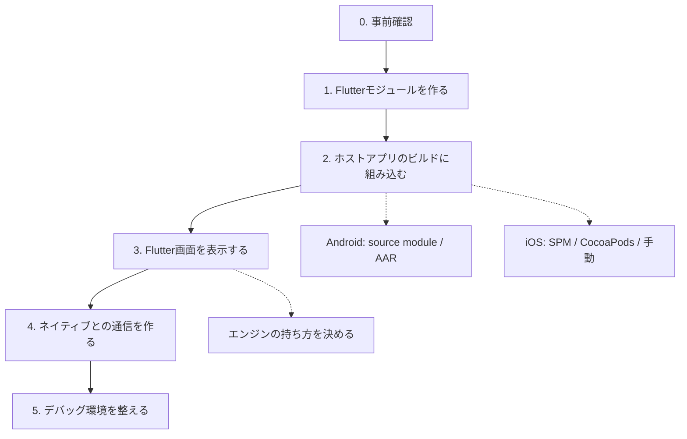

# add-to-app 導入手順

既存のネイティブアプリ（Android / iOS）にFlutterを組み込み、画面単位で
移行していくための手順書。

- 対象: 既存アプリにFlutterを初めて組み込む担当者
- 前提知識: 各プラットフォームの通常のビルド手順
- プロジェクト固有の内容は含まない

このリポジトリで実際に手順をなぞった記録は `GUIDE_VERIFICATION_LOG.md`
にある。手順に誤りや不足が見つかった場合はこのファイルを更新する。

---

## 0. 事前確認

### 0.1 設計上の制約

導入方式を決める前に確認する。後から変更すると作り直しになる。

| 制約 | 内容 |
|---|---|
| Flutterモジュールは1アプリに1つ | 複数のFlutterライブラリを1つのアプリに組み込むことはできない。画面ごとにモジュールを分ける構成は取れない |
| モバイルはマルチエンジンのみ | 1つのDartプログラムから複数ビューを出す方式（マルチビュー）はWeb専用 |
| AndroidXが必須 | Androidホストアプリは AndroidX 化されていること |
| 対応ABI | Androidは x86_64 / armeabi-v7a / arm64-v8a のみ |
| プラグインの互換性 | `FlutterPlugin` インターフェースに対応していること。`FlutterActivity` が常に存在する前提で書かれたプラグインは動作しない場合がある |

### 0.2 バージョン要件

**Flutter SDK のバージョンが、ホストアプリのビルドツールに要求する下限を
決める。** 要求値はFlutter SDKの更新で変わるため、着手時に手元の環境で確認する。

以下は Flutter 3.47.1 における値。

| 対象 | 要件 | 確認コマンド | 期待する結果 |
|---|---|---|---|
| Flutter SDK | iOSでSPM方式を使う場合 3.44 以上 | `flutter build --help` | 一覧に `swift-package` がある |
| Android: Gradle | 8.14 以上 | `./gradlew -version` | `Gradle 8.14` 以上 |
| Android: Android Gradle Plugin | 8.11.1 以上 | ルートの `build.gradle` の `classpath 'com.android.tools.build:gradle:...'` | `8.11.1` 以上 |
| Android: Gradleを動かすJDK | 17 以上 | `./gradlew -version` | `Launcher JVM` が `17` 以上 |
| Android: AndroidX | 必須 | `gradle.properties` | `android.useAndroidX=true` |
| iOS: Xcode | 15.0 以上 | `xcodebuild -version` | `Xcode 15.0` 以上 |

満たさない場合、Flutter Gradleプラグインが下限を明示したエラーを出す。

```
> Error: Your project's Gradle version (8.9.0) is lower than Flutter's
  minimum supported version of 8.14.0. Please upgrade your Gradle version.
```

**JDKの要件はホストアプリの `compileOptions` とは別物。** `compileOptions` が
`VERSION_1_8` のままでもビルドは通る。要件を満たす必要があるのは
`./gradlew -version` が表示する `Launcher JVM`。

### 0.3 ディレクトリ配置

Flutterモジュールはホストアプリと**兄弟ディレクトリ**に置く。以降のスニペットは
この配置を前提としている。

```
my_flutter_module/
  lib/
MyAndroidApp/
MyiOSApp/
```

---

## 1. 全体の流れ



各ステップの終わりでビルドと動作確認を行う。

---

## 2. Flutterモジュールを作る

```bash
flutter create -t module --org com.example my_flutter_module
```

通常のアプリではなく**モジュール**として作る。生成される `.android/` と
`.ios/` は、ホストアプリに組み込むための足場と、モジュール単体で動作確認する
ためのラッパーアプリを兼ねる。

### 2.1 生成物をバージョン管理から除外する

`.android/` と `.ios/` は `flutter pub get` のたびに再生成される。直接編集
しない。

```gitignore
my_flutter_module/.android/
my_flutter_module/.ios/
my_flutter_module/build/
my_flutter_module/.dart_tool/
my_flutter_module/.flutter-plugins-dependencies
```

### 2.2 モジュール名

**条件**: 1アプリに1モジュールしか組み込めないため、このモジュールは将来
Flutter化するすべての画面の置き場になる。最初にFlutter化する機能名を付けると
2画面目で実態と合わなくなる。

**対処**: ホストアプリに紐づく名前にする（`myapp_flutter` など）。

### 2.3 androidPackage の確認

**条件**: `module.androidPackage` がホストアプリのパッケージ名と異なること。
同一だとDexのマージで衝突する。

**確認**:

```bash
grep -A3 "^  module:" my_flutter_module/pubspec.yaml
grep "applicationId" MyAndroidApp/app/build.gradle
```

`flutter create` はモジュール名から `com.example.<module_name>` を自動生成する
ため、モジュール名をホストアプリ名と同じにしない限り問題にならない。

---

## 3. Androidへ組み込む

### 3.1 リポジトリ設定を settings.gradle に集約する

各 `build.gradle` から依存解決用の `repositories` ブロックを削除し、
`settings.gradle` にまとめる。

```groovy
dependencyResolutionManagement {
    repositoriesMode = RepositoriesMode.PREFER_SETTINGS
    repositories {
        google()
        mavenCentral()
        maven { url = uri("https://storage.googleapis.com/download.flutter.io") }
    }
}
```

- **Flutterエンジン本体の配布先 `download.flutter.io` を必ず追加する**
- ルートの `buildscript { repositories { ... } }` は**残す**。依存解決用の
  リポジトリとは別物で、削除するとビルドツール自体が解決できなくなる

**条件**: `repositoriesMode` が `FAIL_ON_PROJECT_REPOS` でないこと。

**確認**: `settings.gradle` を見る。`FAIL_ON_PROJECT_REPOS` のまま組み込むと
次のエラーになる。

```
> Failed to apply plugin 'dev.flutter.flutter-gradle-plugin'.
   > Build was configured to prefer settings repositories over project
     repositories but repository 'maven' was added by plugin
     'dev.flutter.flutter-gradle-plugin'
```

`PREFER_SETTINGS` に緩和すると、同じ文言が警告として出るだけになる。

### 3.2 組み込み方式を選ぶ

| 方式 | 適する状況 |
|---|---|
| **source module** | ローカル開発。ワンステップで組み込めるが、ビルドする全員のマシンにFlutter SDKが必要 |
| **AAR** | ホスト側の開発者にFlutter SDKを要求できない場合。Flutterモジュールのビルドとホストアプリのビルドを分離できる |

判断の軸は Flutterコードの量ではなく、**Flutterを触らない開発者の割合**。

### 3.3-A source module 方式

```groovy
// settings.gradle
include(":app")
setBinding(new Binding([gradle: this]))
def filePath = settingsDir.parentFile.toString() + "/my_flutter_module/.android/include_flutter.groovy"
apply from: filePath
```

```groovy
// app/build.gradle
dependencies {
    implementation(project(":flutter"))
}
```

追加されるサブプロジェクト名は `:flutter` に固定されている。

### 3.3-B AAR 方式

```bash
cd my_flutter_module
flutter build aar
```

出力されたローカルmavenリポジトリを `settings.gradle` のリポジトリに追加し、
build type ごとに依存を指定する。

```groovy
dependencies {
    debugImplementation   'com.example.my_flutter_module:flutter_debug:1.0'
    profileImplementation 'com.example.my_flutter_module:flutter_profile:1.0'
    releaseImplementation 'com.example.my_flutter_module:flutter_release:1.0'
}
```

**条件**: AARが提供するのは `debug` / `profile` / `release` の3つのみ。

**対処**: ホストアプリに `profile` build type を定義する。さらに独自の
build type（`staging` など）がある場合は `matchingFallbacks` を指定する。

```groovy
buildTypes {
    profile { initWith debug }
    staging { matchingFallbacks = ['release', 'debug'] }
}
```

### 3.4 ABIを絞る（任意）

Flutterは x86_64 / armeabi-v7a / arm64-v8a のみ対応する。未設定でもビルド・
実行はできる。ホストアプリがこれ以外のABIをサポートしている場合、そのABI向けの
APKにFlutterのネイティブライブラリが含まれず実行時に失敗するため、絞り込む。

```groovy
android {
    defaultConfig {
        ndk { abiFilters "armeabi-v7a", "arm64-v8a", "x86_64" }
    }
}
```

### 3.5 確認

```bash
cd MyAndroidApp
./gradlew assembleDebug
```

---

## 4. iOSへ組み込む

### 4.1 方式を選ぶ

| 方式 | 状態 | 適する状況 |
|---|---|---|
| **Swift Package Manager** | 推奨（Flutter 3.44以降） | 新規に導入する場合 |
| CocoaPods | メンテナンスモード | 既にCocoaPodsを使っている場合 |
| 手動フレームワーク埋め込み | レガシー | SPMもCocoaPodsも使えない場合 |

CocoaPodsのレジストリは2026年12月2日に読み取り専用になる。

### 4.2-A Swift Package Manager 方式

```bash
cd my_flutter_module
flutter build swift-package --platform ios
```

`build/ios/SwiftPackages/` に `FlutterNativeIntegration` パッケージと連携用
スクリプトが出力される。

**条件**: 出力先は `build/` 配下、つまりバージョン管理対象外。

**対処**: チェックアウト直後とCIでは、Xcodeプロジェクトを開く／ビルドする前に
必ずこのコマンドを実行する。Androidの `.android/` が `flutter pub get` で
生成されるのとは異なり、iOSは明示的な実行が必要。

#### Xcode で設定する場合

1. 生成されたパッケージを **Add Files to...** で追加（**Reference files in place**）
2. Target の **General** → **Frameworks, Libraries, and Embedded Content** に追加
3. Build Settings に `FLUTTER_SWIFT_PACKAGE_OUTPUT` を設定
4. Scheme の **Pre-action** に `flutter_integration.sh prebuild` を追加
5. Build Phases に Run Script `flutter_integration.sh assemble` を追加し、
   **「Based on dependency analysis」のチェックを外す**。Input File Lists に
   `FlutterAssembleInputs.xcfilelist` を追加

Xcodeからビルドするたびにflutterアプリを再ビルドさせる場合は
`FLUTTER_APPLICATION_PATH` と `ENABLE_USER_SCRIPT_SANDBOXING=NO` も設定する。

#### プロジェクト生成ツールを使っている場合

**条件**: XcodeGenやTuistでプロジェクトを生成している場合、上記のGUI操作は
再生成のたびに失われる。

**対処**: 定義ファイル側に書く。XcodeGen では次のように全手順を表現できる。

```yaml
packages:
  FlutterNativeIntegration:
    path: ../my_flutter_module/build/ios/SwiftPackages/FlutterNativeIntegration

targets:
  MyApp:
    dependencies:
      - package: FlutterNativeIntegration
    settings:
      base:
        FLUTTER_SWIFT_PACKAGE_OUTPUT: $(SRCROOT)/../my_flutter_module/build/ios/SwiftPackages
        FLUTTER_APPLICATION_PATH: $(SRCROOT)/../my_flutter_module
        ENABLE_USER_SCRIPT_SANDBOXING: NO
    postCompileScripts:
      - name: "[Flutter] assemble"
        script: /bin/sh "$FLUTTER_SWIFT_PACKAGE_OUTPUT/Scripts/flutter_integration.sh" assemble
        basedOnDependencyAnalysis: false
        inputFileLists:
          - $(FLUTTER_SWIFT_PACKAGE_OUTPUT)/Scripts/FlutterAssembleInputs.xcfilelist

schemes:
  MyApp:
    build:
      preActions:
        - name: "[Flutter] prebuild"
          script: /bin/sh "$FLUTTER_SWIFT_PACKAGE_OUTPUT/Scripts/flutter_integration.sh" prebuild
          settingsTarget: MyApp
```

#### import するモジュール

`FlutterNativeIntegration` は中身が空のシムで、Flutter本体は別モジュールに
ある。Swiftからは次の2つをimportする。

```swift
import Flutter                    // FlutterEngine, FlutterViewController など
import FlutterPluginRegistrant    // GeneratedPluginRegistrant
```

パッケージの依存関係は
`FlutterNativeIntegration → FlutterPluginRegistrant → FlutterFramework → Flutter`。

### 4.2-B CocoaPods 方式

```ruby
flutter_application_path = '../my_flutter_module'
load File.join(flutter_application_path, '.ios', 'Flutter', 'podhelper.rb')

target 'MyApp' do
  install_all_flutter_pods(flutter_application_path)
  flutter_post_install(installer) if defined?(flutter_post_install)
end
```

```bash
pod install
```

**条件**: `flutter_post_install` を記述すること。無いと
`Missing flutter_post_install(installer) in Podfile post_install block` で
失敗する。このフックがbitcode設定・デプロイメントターゲット・Swiftバージョンを
調整する。

作られるPod名は `Flutter` / `FlutterPluginRegistrant` に固定されている。

以降、ビルドは必ず `.xcworkspace` に対して行う。

### 4.2-C 手動フレームワーク埋め込み方式

```bash
flutter build ios-framework --output=release
```

`App.xcframework` / `Flutter.xcframework` / `FlutterPluginRegistrant.xcframework`
と各プラグインの `.xcframework` を **Frameworks, Libraries, and Embedded
Content** に追加する（Copy Bundle Resources ではない）。Run Script Build Phase に
`xcode_backend.sh build` と `xcode_backend.sh embed` を追加する。

Dartを変更しても、再度コマンドを実行するまでホスト側に反映されない。

### 4.3 プロジェクト生成ツールとの併用順序

**条件**: プロジェクト再生成は、CocoaPodsやXcodeが `.pbxproj` に注入した設定を
消す。

**対処**: 以下の順序を毎回守る。

```
プロジェクト定義を変更
  → xcodegen generate（等）
  → pod install（CocoaPods方式の場合）
  → .xcworkspace / .xcodeproj をビルド
```

### 4.4 Debugビルドにローカルネットワーク権限を追加する

**条件**: `flutter attach`（ホットリロード・DevTools）にはローカルネットワーク
権限が必要。

**確認**: 無い場合、ビルド時に次の警告が出る。

```
Info.plist: Could not extract value, error: No value at that key path or
invalid key path: NSBonjourServices
```

**対処**: Debug構成のInfo.plistに追加する。

```xml
<key>NSBonjourServices</key>
<array>
  <string>_dartVmService._tcp</string>
</array>
<key>NSLocalNetworkUsageDescription</key>
<string>Allows Flutter debugging and hot reload</string>
```

Release構成には `_dartVmService._tcp` を含めない。Build Settings の
**Info.plist File** を `$(SRCROOT)/path/to/Info-$(CONFIGURATION).plist` に
することで構成ごとに切り替えられる。

### 4.5 確認

```bash
cd MyiOSApp
xcodebuild -workspace MyApp.xcworkspace -scheme MyApp \
  -sdk iphonesimulator -configuration Debug \
  -destination "generic/platform=iOS Simulator" build
```

---

## 5. Flutter画面を表示する

### 5.1 エンジンの持ち方を決める

| 方式 | 起動速度 | メモリ | 適する用途 |
|---|---|---|---|
| 新規エンジン | 遅い | 1つあたり数十MB | 画面が1〜2個で、毎回状態を初期化したい |
| キャッシュエンジン | 速い | 常時1つ分を保持 | タブなど長く生き続ける画面 |
| **FlutterEngineGroup** | 2つ目以降が速い | 追加分は約180kB | 画面数が増えていく前提 |

`FlutterEngineGroup` を既定とする。グループから生成したエンジンは以下を共有
する。

| 共有される | 独立している |
|---|---|
| GPUコンテキスト | ナビゲーションスタック |
| フォントメトリクス | UIの描画 |
| isolate group snapshot | アプリの状態 |

**条件**: 少なくとも1つのエンジンが生存していること。すべて破棄すると、次に
作るエンジンは1つ目のコストに戻る。

エンジン同士は独立したDartプログラムのため、Dartコード同士は直接やり取り
できない。必要な場合はプラットフォームチャネルを経由する。

### 5.2 Android

`AndroidManifest.xml` にFlutter画面用のActivityを登録する。

```xml
<activity
  android:name="io.flutter.embedding.android.FlutterActivity"
  android:theme="@style/AppTheme"
  android:configChanges="orientation|keyboardHidden|keyboard|screenSize|locale|layoutDirection|fontScale|screenLayout|density|uiMode"
  android:hardwareAccelerated="true"
  android:windowSoftInputMode="adjustResize" />
```

**条件**: `android:theme` に指定するテーマが存在すること。公式ドキュメントの
スニペットは `@style/LaunchTheme` を参照しているが、これはFlutterが新規アプリを
生成するときに作るテーマで、既存アプリには存在しない。

**確認**: ビルドして次のエラーが出ないこと。

```
AAPT: error: resource style/LaunchTheme
  (aka com.example.myapp:style/LaunchTheme) not found.
```

**対処**: ホストアプリ既存のテーマを指定するか、専用テーマを定義する。

起動方法はエンジンの持ち方によって変わる。

```kotlin
// 新規エンジン
startActivity(FlutterActivity.withNewEngine().initialRoute("/my_route").build(this))

// キャッシュエンジン
startActivity(FlutterActivity.withCachedEngine("my_engine_id").build(this))
```

`FlutterEngineGroup` を使う場合は、グループからエンジンを生成し、
`FlutterEngineCache` に入れて `withCachedEngine` で起動する。

```kotlin
val group = FlutterEngineGroup(context)
val engine = group.createAndRunEngine(
    context,
    DartExecutor.DartEntrypoint.createDefault(),
    "/my_route",          // 初期ルート
)
FlutterEngineCache.getInstance().put(ENGINE_ID, engine)
startActivity(FlutterActivity.withCachedEngine(ENGINE_ID).build(context))
```

`FlutterActivity.NewEngineInGroupIntentBuilder` を使えばキャッシュを介さずに
起動できる。

**条件**: キャッシュエンジンに初期ルートを指定する場合、Dartのエントリポイントを
実行する**前**に設定すること。

```kotlin
flutterEngine.navigationChannel.setInitialRoute("/my_route")
flutterEngine.dartExecutor.executeDartEntrypoint(DartExecutor.DartEntrypoint.createDefault())
```

画面の一部分に埋め込む場合は `FlutterFragment` を使う。

### 5.3 iOS

```swift
import Flutter
import FlutterPluginRegistrant

private static let engineGroup = FlutterEngineGroup(name: "my_group", project: nil)

static func viewController(route: String) -> UIViewController {
    // entrypoint に nil を渡すと main() が使われる
    let engine = engineGroup.makeEngine(
        withEntrypoint: nil,
        libraryURI: nil,
        initialRoute: route
    )
    GeneratedPluginRegistrant.register(with: engine)
    return FlutterViewController(engine: engine, nibName: nil, bundle: nil)
}
```

- オプション型は `FlutterEngineGroup` のネストした型ではなく
  `FlutterEngineGroupOptions` という独立したクラス
- **プラグインの登録はエンジンを実行した後に行う。** 順序を誤ると
  `Setting a message handler before the FlutterEngine has been run` で
  クラッシュする
- ホストの `UINavigationController` のバーとFlutter側のAppBarが重なる場合は、
  表示・非表示を切り替える

### 5.4 初期ルートを1画面に固定する

**条件**: `MaterialApp` の `initialRoute` は `/` で分割され、セグメントごとに
画面が積まれる。`/confirm` を渡すと `['/', '/confirm']` の2画面になる。

**確認**: 次のいずれかが起きる。

- Flutter側のAppBarに意図しない戻る矢印が表示される
- 戻る操作でネイティブに戻らず、`/` の画面が現れる

**対処**: `onGenerateInitialRoutes` で初期スタックを1画面に固定する。

```dart
MaterialApp(
  initialRoute: PlatformDispatcher.instance.defaultRouteName,
  onGenerateInitialRoutes: (String initialRoute) => <Route<Object?>>[
    onGenerateRoute(RouteSettings(name: initialRoute)),
  ],
  onGenerateRoute: onGenerateRoute,
)
```

### 5.5 キャッシュエンジンのライフサイクル

キャッシュエンジンはUIのコンテナより長生きし、画面が破棄された後もDartコードは
動き続ける。UIが無い状態での通信やデータ処理に利用できる。停止する場合は
明示的に `destroy()` する。

---

## 6. ネイティブとの通信

### 6.1 チャネルの粒度

チャネルは画面単位ではなく**機能単位**で切る。画面単位にすると画面数だけ
ハンドラが増える。機能単位なら画面が増えてもチャネルは増えず、機能がFlutterへ
移るたびに減る。

| 例 | 役割 |
|---|---|
| `<app>/navigation` | Flutterの領域から出る遷移をネイティブへ依頼する |
| `<app>/legacy_store` | 移行前のネイティブコードが保存したローカルデータを読む |
| `<app>/session` | 認証トークン・共通ヘッダ |

### 6.2 既存のローカルデータの引き継ぎ

| 種類 | 既存データをそのまま読めるか | 理由 |
|---|---|---|
| SQLite | 読める | 絶対パスでファイルを開くだけ |
| キーバリューストア | 既定では読めない | キーにプレフィックスが付く。Androidは保存先ファイルもFlutter専用になる |
| ファイル | Androidは注意 | 「ドキュメント」の解決先がネイティブと異なる |
| セキュアストレージ | 設定が必要 | プラグインが独自のservice名でアイテムを作る |

**条件**: 同じデータをネイティブとFlutterの両方から読み書きしないこと。

**対処**: データごとに所有者を決める。

- 移行期間中も双方が参照するデータ — ネイティブを所有者とし、チャネルで渡す
- Flutterへ完全に移すデータ — 起動時に一度だけ旧データを読んで新形式へ書き換え、
  移行済みフラグを立てて二度と読まない

---

## 7. デバッグ

アプリの起動はネイティブのIDE側が行うため `flutter run` は使えない。アプリを
起動してFlutter画面を表示した状態で `flutter attach` する。

```bash
cd my_flutter_module
flutter attach -d <device-id>      # flutter devices で確認
```

対話操作なしでホットリロードする場合は `--pid-file` を使う。

```bash
flutter attach -d <device-id> --pid-file=/tmp/flutter.pid
kill -SIGUSR1 $(cat /tmp/flutter.pid)   # ホットリロード
kill -SIGUSR2 $(cat /tmp/flutter.pid)   # ホットリスタート
```

### 7.1 iOSで自動探索に失敗する場合

**確認**: `Waiting for a connection from Flutter on ...` から進まない。

**対処**: VMサービスのURLをデバイスログから取得して直接渡す。

```bash
xcrun simctl spawn <udid> log show --last 3m \
  --predicate 'processImagePath CONTAINS "MyApp"' --style compact \
  | grep "Dart VM service"
# flutter: The Dart VM service is listening on http://127.0.0.1:65135/AHGlBZAIIvs=/

flutter attach -d <udid> --debug-url "http://127.0.0.1:65135/AHGlBZAIIvs=/"
```

### 7.2 ホットリロードが反映されない場合

**条件**: ルートの画面をインラインのクロージャで組んでいると、ホットリロードが
成功と表示されても画面が更新されない。

**対処**: 画面をWidgetクラスとして切り出す。

```dart
// 反映されない
builder: (_) => Scaffold(appBar: AppBar(...), body: ...)
// 反映される
builder: (_) => MyScreen()
```

切り出せない場合はホットリスタートで確認する。

### 7.3 デバッグ対象と道具

| 対象 | 使うもの |
|---|---|
| Dartのコード | `flutter attach` + DevTools |
| ネイティブのコード | Android Studio / Xcode のデバッガ |
| 境界（チャネル） | 両側にログ。チャネル名・メソッド名・引数の型のいずれかが食い違うと無言で失敗する |

### 7.4 ビルドの反映を確認する

APK/アプリが更新されているか怪しい場合、画面に表示される一意な文字列を一時的に
仕込んで確認する。バイナリ内のシンボルを `strings` で探す方法は、Flutter
フレームワーク側に同名のものがあると判定にならない。

Androidでは、DebugビルドのAPKが大きいため上書きインストールが
`INSTALL_FAILED_INSUFFICIENT_STORAGE` で失敗することがある。`adb uninstall`
してから `adb install` する。

---

## 8. 段階移行のための設計

### 8.1 フィーチャーフラグ

**条件**: Flutter化した画面に問題が見つかったとき、リリースを待たずネイティブ
実装へ戻せること。画面が増えてから後付けするのは難しいため、1画面目の時点で
入れる。

**対処**: 「この画面へ行きたい」という要求を受けて、ネイティブ実装とFlutter
実装のどちらを開くかを決める層を1つ作る。呼び出し側がフラグを直接参照する
作りにすると、Flutter化のたびに分岐がアプリ中に散らばる。

同じ画面の両実装を実行時に切り替えられるため、問題の切り分けにも使える。

### 8.2 新規コードの言語

Flutter統合のために新規に書くコードは、既存がJava / Objective-Cでも
Kotlin / Swiftで書ける。

**Android**

- 同一Gradleモジュール内でJavaとKotlinは共存でき、相互に呼び出せる
- **条件**: JavaとKotlinのJVMターゲットが一致していること。不一致だと
  `Inconsistent JVM-target compatibility detected` で失敗する

```groovy
android {
    compileOptions { sourceCompatibility JavaVersion.VERSION_1_8 }
    kotlinOptions { jvmTarget = '1.8' }
}
```

**iOS**

- Objective-CからSwiftを参照するには、自動生成される
  `<ProductModuleName>-Swift.h` をimportする
- SwiftからObjective-Cを参照するにはBridging Headerを設定する
- **条件**: Bridging Header は「Swift→ObjC」だけの設定ではない。無い場合、
  生成される `-Swift.h` に `internal` な `@objc` クラスが書き出されず、
  Objective-C側が `use of undeclared identifier` になる

| 条件 | `internal` な `@objc` クラスが `-Swift.h` に出るか |
|---|---|
| Bridging Header なし | 出ない（`public` にすれば出る） |
| Bridging Header あり | 出る |

- Swiftファイルを1つでも追加する場合、`SWIFT_VERSION` と
  `ALWAYS_EMBED_SWIFT_STANDARD_LIBRARIES` を設定する
- プロジェクト生成ツールを使っている場合、`SWIFT_INSTALL_OBJC_HEADER` と
  `SWIFT_OBJC_INTERFACE_HEADER_NAME` が既定で設定されないことがある

---

## 9. 症状と対処の一覧

| 症状 | 原因 | 対処 |
|---|---|---|
| Gradle / AGP のバージョンでビルド失敗 | Flutter SDKが要求する下限を下回っている | 0.2節 |
| `Build was configured to prefer settings repositories ...` | `repositoriesMode` が `FAIL_ON_PROJECT_REPOS` | 3.1節 |
| `Inconsistent JVM-target compatibility detected` | JavaとKotlinのJVMターゲット不一致 | 8.2節 |
| `AAPT: error: resource style/LaunchTheme not found` | 公式スニペットのテーマが存在しない | 5.2節 |
| `pod install` が `Missing flutter_post_install` で失敗 | Podfileのフック未記載 | 4.2-B節 |
| iOSでFlutter依存が見つからない | `.xcodeproj` を直接開いている | 4.2-B節 |
| プロジェクト再生成後にビルドフェーズが消える | 生成 → `pod install` の順序 | 4.3節 |
| `cannot find 'FlutterEngineGroup' in scope`（SPM） | `import Flutter` していない | 4.2-A節 |
| ObjCから `use of undeclared identifier <Swiftのクラス>` | Bridging Header が無い | 8.2節 |
| `Setting a message handler before the FlutterEngine has been run` | プラグイン登録がエンジン実行より前 | 5.3節 |
| 戻る操作でネイティブに戻らない／AppBarに余分な戻る矢印 | `initialRoute` が分割されている | 5.4節 |
| 画面を増やすほどメモリが増える | `FlutterEngineGroup` を使っていない | 5.1節 |
| Flutter画面を閉じても処理が動き続ける | キャッシュエンジンを `destroy()` していない | 5.5節 |
| iOSで `flutter attach` が繋がらない | 権限が無い／自動探索が働かない | 4.4節 / 7.1節 |
| ホットリロードが成功と出るのに画面が変わらない | ルートの画面がインラインのクロージャ | 7.2節 |
| `INSTALL_FAILED_INSUFFICIENT_STORAGE` | Debug APKが大きく上書きできない | 7.4節 |

---

## 参考

- [Add Flutter to an existing app](https://docs.flutter.dev/add-to-app)
- [Integrate a Flutter module into your Android project](https://docs.flutter.dev/add-to-app/android/project-setup)
- [Adding a Flutter screen to an Android app](https://docs.flutter.dev/add-to-app/android/add-flutter-screen)
- [Integrate a Flutter module into your iOS project](https://docs.flutter.dev/add-to-app/ios/project-setup)
- [Multiple Flutter instances](https://docs.flutter.dev/add-to-app/multiple-flutters)
- [Debugging your add-to-app module](https://docs.flutter.dev/add-to-app/debugging)
