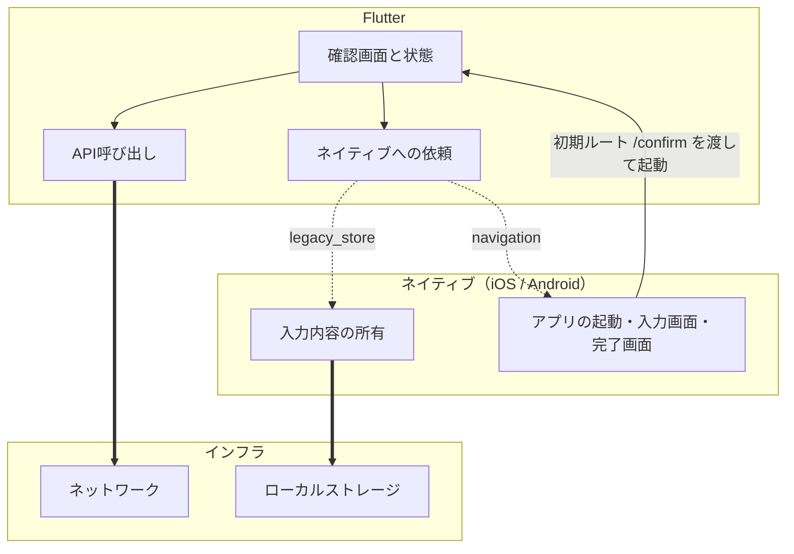

# 移行計画 — Todo（メモ）の確認画面

このリポジトリで実施した1画面のFlutter化について、**何をどう決めたか**の記録。

雛形は `MIGRATION_PLAN_TEMPLATE.md`。手順は `MIGRATION_GUIDE.md`。
経過と判断の理由は `WORK_LOG.md` にある。

| 資料 | 内容 |
|---|---|
| `MIGRATION_GUIDE.md` | **移行の手順**。条件・手順・確認方法。プロジェクトに依存しない |
| この資料 | **移行の計画**。アーキテクチャ・役割分担など、移行前に決めたこと |

---

## 1. 目的と対象

### 1.1 目的

**全面移行の判断材料を得ること**、および `MIGRATION_GUIDE.md` の手順が
書いてあるとおりで動くかを検証すること。

この目的により、**画面を増やす前提の構成を選ぶ**。1画面だけを見れば過剰な作りに
なる箇所があるが、いずれも「画面が増えたときに何が増えるか」で選んでいる。

### 1.2 対象画面

**Todo（メモ）フローの確認画面**（移行前は `ConfirmActivity` /
`ConfirmViewController`）。

選定基準をすべて満たしている。

| 基準 | 該当 |
|---|---|
| 既存データの扱いが読み取りだけ | 入力内容を読んで表示するだけで、書き戻さない |
| 画面遷移が単純 | 入力画面から入り、完了画面へ抜ける。出入り口が各1つ |
| 更新頻度が低い | 移行中に元の画面が変わる見込みがない |
| 端末機能に依存しない | カメラ・位置情報などを使わない |
| 画面内で完結する | 送信するだけで、他画面と状態を共有しない |

満たさない基準はない。

### 1.3 範囲外

- **入力画面と完了画面** — ネイティブのまま。完了画面へは `navigation` チャネルで抜ける
- **Music タブ全体** — SQLite を持つため、ローカルデータの所有権の分割が必要になる
- **Release ビルド** — 検証していない（9節）

---

## 2. 前提条件の確認

| 項目 | 要件 | 現状値 | 対応 |
|---|---|---|---|
| Flutter SDK | iOSでSPMを使うなら3.44以上 | **3.47.0 以上**をサポート（手元は3.47.1） | — |
| Gradle | 8.14以上 | **8.9** | **9.1.0 へ更新**（警告側まで） |
| Android Gradle Plugin | 8.11.1以上 | **8.7.0** | **8.11.1 へ更新**。警告側（9.0.1）は Flutter 3.47 と非互換のため据え置き |
| Gradleを動かすJDK | 17以上 | 21.0.10 | — |
| AndroidX | 必須 | `android.useAndroidX=true` | — |
| Xcode | 15.0以上 | 26.6 | — |
| iOS Deployment Target | 15.0以上 | 16.0 | — |
| プラグインの互換性 | `FlutterPlugin` 対応 | **プラグイン未使用** | — |

Gradle と AGP が下限を下回っていたため、着手前に更新した。**この2件が今回唯一の
ビルド失敗**で、いずれも手順0.2節の表から事前に特定できている。

依存パッケージ（`http` / `pigeon` / `flutter_riverpod`）はいずれも純粋なDartで、
プラットフォーム側のコードを持たない。プラグインの互換性は問題にならない。

---

## 3. 決めたこと

### 3.1 Androidの組み込み方式 — source module

**理由**: このプロジェクトでは全員がFlutterを扱う前提のため。判断の軸は
Flutterコードの量ではなく**Flutterを触らない開発者の割合**で、AAR にする理由が
ない。ワンステップで組み込める利点を取った。

**代償**: ホストアプリをビルドする全員のマシンにFlutter SDKが要る（8節）。

### 3.2 iOSの組み込み方式 — Swift Package Manager

**理由**: 新規に組み込むため。CocoaPodsはメンテナンスモードで、レジストリが
2026年12月2日に読み取り専用になる。既存アプリがCocoaPodsを使っていない。

### 3.3 エンジンの持ち方 — FlutterEngineGroup

**理由**: 画面を増やしていく前提のため。2つ目以降のエンジンの追加コストが
約180kBに収まる。

**代償**: 画面を開くたびに新しいエンジンが作られるため、**Dart側の状態は
画面を開き直すと失われる**（5.1節）。

### 3.4 Flutterモジュールの識別子 — `--org com.example` / `legacyapp_flutter`

```yaml
module:
  androidPackage: com.example.legacyapp_flutter
  iosBundleIdentifier: com.example.legacyappFlutter
```

**理由**: 1アプリに1モジュールしか組み込めず、将来Flutter化するすべての画面の
置き場になる。ホストアプリ名（LegacyApp）に紐づけ、機能名を含めていない。

`androidPackage` はホストアプリの `applicationId`（`com.example.legacyapp`）と
異なる。一致するとDexのマージで衝突する。

---

## 4. Flutterとネイティブの役割分担



破線が `MethodChannel`。**移行完了時にどちらも消える。**

| 機能 | 移行期間中の所有者 | 移行完了後 | 決めた内容 |
|---|---|---|---|
| 画面遷移 | 両方 | Flutter | Flutter画面同士はFlutterの `Navigator`。完了画面へ抜けるときだけ `navigation` チャネルでネイティブへ依頼する |
| ローカルデータ | **ネイティブ** | Flutter | 入力画面がまだネイティブで書き込むため、所有者を分割できない。Flutterは `legacy_store` で読むだけ |
| ネットワーク | **Flutter** | Flutter | ネイティブの通信基盤をチャネル越しに呼ぶと、そのブリッジを全画面が使い、移行完了時に全部捨てることになる |
| 認証・トークン | — | — | **このアプリに認証が無いため対象外**（9節） |
| ログ・計測 | — | — | **このアプリに計測が無いため対象外**（9節） |
| 画像・アイコン | **Flutter** | Flutter | `profile_banner.png` をモジュールへ移設。移行完了までネイティブ側にも同じ画像が残る |
| 文言 | **Flutter** | Flutter | ARBへ移設。未対応だとFlutter画面だけ言語が切り替わらない |
| ナビゲーションバー | **ネイティブ** | Flutter | 移行前と同じ見た目にするため。両方が持つと二重になる。Androidは `FlutterActivity` にActionBarが出ないため、専用テーマを追加した |

---

## 5. アーキテクチャ

### 5.1 Dart側の構成

[公式のapp architecture guide](https://docs.flutter.dev/app-architecture/guide) に沿う。

```
lib/
  main.dart                                       エントリポイント（唯一）
  main_dev.dart                                   モジュール単体実行用
  routing/{routes,router}.dart                    ルート定義と解決
  ui/confirm/widgets/confirm_screen.dart          View
  ui/confirm/view_models/confirm_view_model.dart  Provider（状態と手続き）
  ui/core/themes/app_theme.dart                   テーマ
  ui/core/l10n/arb/{app_en,app_ja}.arb            文言
  data/repositories/confirm_repository.dart       Repository（本番 / fake）
  data/services/api_client.dart                   HTTP
  data/services/legacy_store_service.dart         チャネル
  data/services/navigation_service.dart           チャネル
  domain/models/form_data.dart                    モデル（Freezed）
```

**「取得はチャネル・送信はFlutterのHTTP」という分かれ目はRepositoryに閉じている。**
ViewModelもViewもどちらがどちらか知らない。

**状態管理とDI — Riverpod**

**理由**: 差し替え点をProviderに集約でき、モジュール単体実行とテストが同じ
`overrides` の仕組みで書ける。読み込み中・失敗・完了の3状態は `AsyncValue` が
持つため、状態を表す enum を自前で用意しなくてよい。

**条件**: **Providerの寿命はFlutterエンジンの寿命と同じ。** 3.3節で
`FlutterEngineGroup` を選んでいるため、ネイティブから画面を開き直すと `main()`
から作り直される。これはRiverpod固有の話ではなく、エンジンが独立したDart
プログラムであることによる（手順5.1節）。

4節で「Flutter画面同士はFlutterの `Navigator`」と決めているため、Flutter化した
画面の間では保持される。失われるのはネイティブを経由して戻る場合だけで、そこは
**そもそも状態を持ち越してはいけない境界**。

### 5.2 ルーティング

**Dartのエントリポイントは `main()` ひとつ。** 表示する画面はネイティブから渡す
初期ルートで決める。

| 項目 | 内容 |
|---|---|
| この画面のルート名 | `/confirm` |
| 画面を増やすときに触る場所 | `routing/routes.dart` へのルート名追加と、`routing/router.dart` の `registeredScreens()` への1行追加のみ。**ネイティブ側の起動コードは増えない** |

初期ルートは `onGenerateInitialRoutes` で1画面のスタックに固定している。既定の
実装は `/` で分割するため、`/confirm` を渡すと2画面積まれる（手順5.4節）。

### 5.3 チャネル設計

**画面単位ではなく機能単位で切る。** 画面が増えてもチャネルは増えず、機能が
Flutterへ移るたびに減る。

| チャネル名 | メソッド | 引数 | 戻り値 | いつ消えるか |
|---|---|---|---|---|
| `com.example.legacyapp/legacy_store` | `readFormData` | なし | `{name, email, message}` | 入力内容の所有がFlutterへ移ったとき |
| `com.example.legacyapp/navigation` | `openNative` | `screen` | なし | 完了画面をFlutter化したとき |

**項目ごとにメソッドを分けず、まとめて返す。** 項目が増えるたびにネイティブ側の
変更が必要になるのを避けるため。

登録場所はFlutter画面全体で1つ。Androidは `FlutterScreenActivity` の
`configureFlutterEngine`、iOSは `FlutterScreenViewController` の初期化時。

**Pigeonで生成するか — `legacy_store` のみ生成する**

**理由**: データを運ぶチャネルは、名前や型の食い違いが**無言で失敗する**。
生成すればコンパイルエラーになる。`navigation` は引数が文字列1つで面が狭いため
手書きのまま残し、両方の書き方を比較できるようにした。

**限界**: Pigeonが保証するのは**名前と型の一致だけ**。登録の順序は防げない。

### 5.4 既存資産の移設

| 種別 | 対象 | 備考 |
|---|---|---|
| 画像 | `profile_banner.png` 1点 | 移行完了までネイティブ側にも同じ画像が残る |
| 文言 | 8件 × ja / en | ネイティブの `strings.xml` / `Localizable.strings` からARBへ |
| フォント | なし | — |

---

## 6. 段階と完了条件

| 段階 | 手順 | 完了条件 | 済 |
|---|---|---|---|
| 前提を満たす | 0節 | 2節の表がすべて埋まり、対応が完了している | 済 |
| モジュールを作る | 2節 | `flutter analyze` が通る | 済 |
| Androidへ組み込む | 3節 | Debugビルドが通り、APKに実体が入り、アプリが起動する | 済 |
| iOSへ組み込む | 4節 | Debugビルドが通り、バンドルに実体が入り、アプリが起動する | 済 |
| Flutter画面を表示する | 5節 | 実機でFlutter画面が出て、戻る操作でネイティブに戻る | 済 |
| ネイティブとのやりとり | 6節 | 実際に値が渡ることを画面で確認した | 済 |
| デバッグ環境 | 7節 | 両OSで `flutter attach` とホットリロードができる | 済 |
| 画面の作り込み | 8節 | 移行前の画面と同じ表示・操作になった | 済 |

**組み込みを先に終わらせ、画面の作り込みは最後に行った。** 7節を終えた時点で
ネイティブ側の作業は完了し、以降はDartだけを触っている（例外はナビゲーション
バーのテーマ追加1件）。

---

## 7. 検証

| 観点 | 結果 |
|---|---|
| 移行前と同じ動作 | 表示・操作とも一致。確定 → POST → 完了画面まで両OSで確認 |
| 既存データの引き継ぎ | **未検証**（9節）。対象画面が読むのはメモリ上の入力内容で、永続化データを扱わないため |
| 両OS | Android（エミュレータ）/ iOS（シミュレータ）で確認 |
| 表示言語 | 端末が英語のとき、ネイティブ画面と同じく英語で表示されることを確認 |
| モジュール単体 | `flutter run -t lib/main_dev.dart`。`overrides` でfakeに差し替わる |
| 自動テスト | 15件。チャネルとHTTPをどちらも差し替え可能にしているため、実機もネットワークも要らない |

---

## 8. 周辺への影響

| 項目 | 実測・決定 |
|---|---|
| アプリサイズ | **Debug APK が約1.4GB**。うち1.3GBがネイティブライブラリで、arm64-v8a 614MB / x86_64 372MB / armeabi-v7a 333MB の内訳。上書きインストールが `INSTALL_FAILED_INSUFFICIENT_STORAGE` で失敗するため、`adb uninstall` してから入れる。**CIではABIを1つに絞り402MBにしている**（手順3.4節）。**Releaseは未測定**（9節） |
| ビルド時間 | **未測定**（9節） |
| CI/CD | GitLab CI を追加。解析・テスト・Android / iOS ビルドの4ジョブ。`source module` のため、Androidのジョブにも Flutter SDK と `.android/include_flutter.groovy` の生成が要る。**共有Runnerのディスクが足りず、ABIを1つに絞る必要があった** |
| デバッグ環境 | iOSは `flutter attach` の自動探索が働かず、`--debug-url` を渡す。ローカルネットワーク権限も追加済み。手順は `DEBUGGING.md` |
| Flutter SDKのバージョン | **3.47.0 以上**をサポート。情報源は `.flutter-version`（下限）で、CIもここを読み**下限そのものでビルドする**。バージョンマネージャは使えないため、`tools/check-flutter-version.sh` と `pubspec.yaml` の下限指定で担保する |
| チームのスキル | **未決定**（9節） |
| 既存ネイティブコードへの変更 | 2件。`BaseActivity.sFormData` の可視性を `public` に広げた（Flutter統合コードから参照するため）、ActionBar用のテーマ `FlutterScreenTheme` を追加した |

---

## 9. 未決定の項目

**この計画で埋まっていない欄。** 実際のプロダクトへ適用する際は、着手前に
決める必要がある。

| 項目 | 未決定の理由 |
|---|---|
| **リスクと切り戻し** | 検証目的のリポジトリのため、続行/中止の判断期限も切り戻し手順も決めていない。**プロダクトでは必須** |
| **認証・トークンの所有者** | このアプリに認証が無いため確かめられていない。ネットワークをFlutterが持つ構成では、トークンの受け渡しと期限更新の担当を決める必要がある |
| **ログ・計測の所有者** | 同上。移行前後で計測が途切れないか、イベント名の体系を合わせるかは未検討 |
| **既存データの引き継ぎ** | 対象画面が永続化データを扱わないため未検証。SQLiteを持つMusicタブは範囲外にした |
| **Releaseビルド** | Debugでしか検証していない。**署名・R8/ProGuard・難読化・アプリサイズの増分が未確認** |
| **ビルド時間の増分** | 測っていない |
| **チームのスキル** | 1人で実施したため、誰がDartを書くかを決めていない。3.1節でsource moduleを選んだ前提（全員がFlutterを扱う）は未検証 |

---

## 10. 決定ログ

| 変えたこと | 理由 |
|---|---|
| 4.4節（ローカルネットワーク権限）の先送りを撤回 | 「デバッグに入るまで不要」と判断して飛ばしたが、根拠のない判断だった。手順の順序どおりに戻した |
| FVMの採用を撤回 | 使えない環境だったため。`.flutter-version` + 検査スクリプト + `pubspec.yaml` の範囲指定に差し替えた |
| `MethodChannel` の手書きから Pigeon へ（`legacy_store` のみ） | 名前と型の食い違いをコンパイルエラーにするため |
| `ChangeNotifier` から Riverpod へ | 差し替え点をProviderに集約するため。`AsyncValue` により状態の enum が不要になった |
| モデルを Freezed で生成 | `copyWith` / `==` / `toJson` の手書きをやめるため。項目を足したときの直し漏れを防ぐ |
