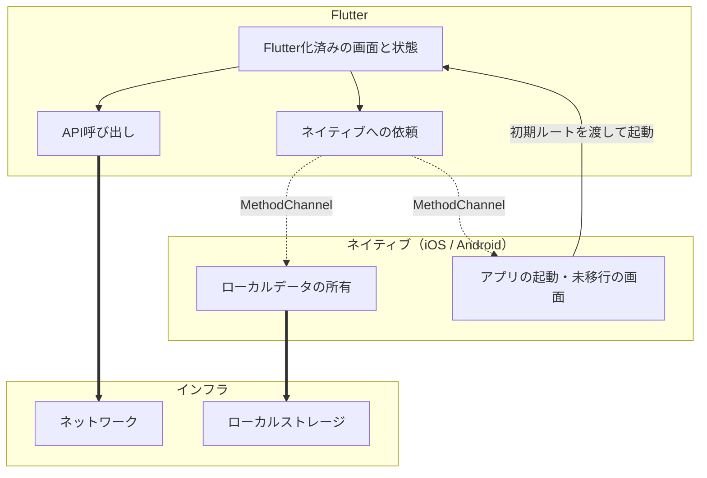

# 移行計画（雛形）

既存アプリの1画面をFlutter化するときの、**アーキテクチャと役割分担の計画**。
移行する画面ごとに1部作り、着手前に埋める。

| 資料 | 内容 |
|---|---|
| `MIGRATION_GUIDE.md` | **移行の手順**。条件・手順・確認方法。プロジェクトに依存しない |
| `MIGRATION_PLAN_TEMPLATE.md` | **移行の計画**。アーキテクチャ・役割分担など、移行前に決めること。画面ごとに1部 |

**この資料には手順を書かない。** 必要な箇所で手順側の節番号を指す。

**埋まらない欄がある状態で着手しない。** 特に2節（前提条件）と3節（決めること）は、
後から変えると作り直しになる。

---

## 1. 目的と対象

### 1.1 目的

この画面をFlutter化して何を得るのかを書く。後段の判断がここに引きずられる。

| 目的 | 後段への影響 |
|---|---|
| 全面移行の判断材料を得る | 画面を増やす前提の構成を選ぶ。1画面には過剰な作りになる |
| 特定機能の刷新のみ | 増やす前提の作りは不要。組み込みは最小限でよい |

```
記入:
```

### 1.2 対象画面の選定

最初の1画面は**移行の成否ではなく、移行の手順を確かめる**ために選ぶ。
以下を満たすほど向いている。

| 基準 | 理由 |
|---|---|
| 既存データの扱いが読み取りだけ | 書き込みがあると所有者の分割が要る（4節） |
| 画面遷移が単純 | 出入り口が少ないほどネイティブ側の変更が減る |
| 更新頻度が低い | 移行中に元の画面が変わると二重メンテになる |
| 端末機能に依存しない | カメラ・位置情報などはプラグインの互換性確認が増える |
| 画面内で完結する | 他画面と状態を共有していると移行境界が引けない |

```
選んだ画面:
理由:
満たさない基準と、その対処:
```

### 1.3 範囲外

やらないことを書く。書かないと途中で膨らむ。

```
記入:
```

---

## 2. 前提条件の確認

ガイド0.1・0.2節の確認結果を埋める。**満たさない項目があれば、その対応が
移行作業の前に入る。**

| 項目 | 要件 | 現状値 | 対応 |
|---|---|---|---|
| Flutter SDK | iOSでSPMを使うなら3.44以上 | | |
| Gradle | | | |
| Android Gradle Plugin | | | |
| Gradleを動かすJDK | 17以上 | | |
| AndroidX | 必須 | | |
| Xcode | 15.0以上 | | |
| iOS Deployment Target | 生成パッケージの宣言値以上 | | |
| プラグインの互換性 | `FlutterPlugin` 対応 | | |

要件の具体値と確認コマンドはガイド0.2節。**Deployment Targetは古いアプリで
最初に効く。**引き上げられない場合はここで判断が要る。

---

## 3. 決めること

後から変えると手戻りが大きい。**判断軸に照らして選び、理由まで書く。**
選んだ方の手順は `MIGRATION_GUIDE.md` にある。

### 3.1 Androidの組み込み方式

| 方式 | 適する状況 |
|---|---|
| **source module** | ローカル開発。ワンステップで組み込めるが、ビルドする全員のマシンにFlutter SDKが必要 |
| **AAR** | ホスト側の開発者にFlutter SDKを要求できない場合。Flutterモジュールのビルドとホストアプリのビルドを分離できる |

判断の軸は Flutterコードの量ではなく、**Flutterを触らない開発者の割合**。

```
選択:
理由:
```

### 3.2 iOSの組み込み方式

| 方式 | 状態 | 適する状況 |
|---|---|---|
| **Swift Package Manager** | 推奨（Flutter 3.44以降） | 新規に組み込む場合 |
| CocoaPods | メンテナンスモード | 既にCocoaPodsを使っている場合 |
| 手動フレームワーク埋め込み | レガシー | SPMもCocoaPodsも使えない場合 |

CocoaPodsのレジストリは2026年12月2日に読み取り専用になる。

```
選択:
理由:
```

### 3.3 エンジンの持ち方

| 方式 | 起動速度 | メモリ | 適する用途 |
|---|---|---|---|
| 新規エンジン | 遅い | 1つあたり数十MB | 画面が1〜2個で、毎回状態を初期化したい |
| キャッシュエンジン | 速い | 常時1つ分を保持 | タブなど長く生き続ける画面 |
| **FlutterEngineGroup** | 2つ目以降が速い | 追加分は約180kB | 画面数が増えていく前提 |

画面を増やしていく前提なら `FlutterEngineGroup`。

```
選択:
理由:
```

### 3.4 Flutterモジュールの識別子

モジュール生成時の2つの引数で決まる。**後から変えるとホストアプリ側の参照も
全部直すことになる。**

```bash
flutter create -t module --org <org> <module_name>
```

生成される `pubspec.yaml` はこうなる。

```yaml
module:
  androidPackage: <org>.<module_name>          # Android
  iosBundleIdentifier: <org>.<moduleName>      # iOS（キャメルケースになる）
```

#### これはホストアプリのIDではない

**ホストアプリのbundle identifier / applicationId とは別物。** モジュールは
フレームワークとしてホストアプリに埋め込まれるため、ホストアプリのIDは変わらない。

| 生成される値 | 何に使われるか |
|---|---|
| `androidPackage` | ホストアプリに追加されるGradleサブプロジェクトのパッケージ |
| `iosBundleIdentifier` | **モジュール単体実行用のラッパーアプリ**のbundle id。ホストアプリには影響しない |

**条件**: `androidPackage` がホストアプリの `applicationId` と一致しないこと。
一致するとDexのマージで衝突する。**フレーバーでsuffixを付けている場合は、
そのどれとも一致しないこと。**

#### `<module_name>` に設定する値

**Dartのパッケージ名の規則に従う。** 小文字とアンダースコアのみ（`[a-z0-9_]`）。
違反すると生成時にエラーになる。

```
"sapp-flutter" is not a valid Dart package name. Try "sapp_flutter" instead.
```

**1アプリに1モジュールしか組み込めない。** 将来Flutter化するすべての画面の
置き場になるため、最初にFlutter化する機能名を付けると2画面目で実態と合わなくなる。
ホストアプリに紐づく名前にする。

```
myapp_flutter     ホストアプリ名 + _flutter
```

#### `<org>` に設定する値

ホストアプリの識別子から**逆ドメインの部分**を取る。末尾のアプリ名部分は
`<module_name>` が担うため含めない。

**渡した値がそのまま両OSに入るわけではない。** 各プラットフォームで使えない文字は
自動で除去される。

| `--org` に含めた文字 | Android | iOS |
|---|---|---|
| ハイフン `-` | **除去される** | 残る |
| アンダースコア `_` | 残る | **除去される** |

Androidのパッケージ名はJavaの識別子である必要がありハイフンを使えない。iOSの
bundle identifierは英数字・ハイフン・ピリオドのみでアンダースコアを使えない。
**この除去はエラーにも警告にもならない。**

```bash
flutter create -t module --org jp.co.example_corp myapp_flutter
```

```yaml
androidPackage: jp.co.example_corp.myapp_flutter     # そのまま
iosBundleIdentifier: jp.co.examplecorp.myappFlutter  # _ が消える
```

**対処**: どちらの区切り文字を渡しても、両OSとも規則を満たす識別子になる。
**ホストアプリのAndroid側 `applicationId` と同じ表記を渡すのが分かりやすい。**
`applicationId` との衝突を目視で確認することになるため、そちらに揃える。

**確認**: 生成後に `pubspec.yaml` を見て、想定した値になっているか確かめる。

```bash
grep -A3 "^  module:" my_flutter_module/pubspec.yaml
```

#### 環境（本番 / Stg / Dev）ごとに分ける必要はない

ホストアプリが環境ごとに識別子を分けていても、**モジュール側は1つでよい。**
モジュールは1アプリに1つしか組み込めず、環境の違いはホストアプリ側が持つ。

Flutter側で環境を知る必要がある場合は、識別子を分けるのではなく**ネイティブから
渡す**（4節の役割分担。設定の所有者はネイティブ）。

```
--org:
module_name:
理由:
```

---

## 4. Flutterとネイティブの役割分担

移行期間中は、同じ関心事を両方が持つ状態になる。**どちらが持つかを機能ごとに
決める。**決めずに始めると、同じデータを二か所が書く状態になる。



破線が `MethodChannel`。**移行完了時に消える前提で設計する。**

| 機能 | 移行期間中の所有者 | 移行完了後 | 決めるときの観点 |
|---|---|---|---|
| 画面遷移 | | | Flutter画面同士はFlutterのNavigator。Flutterの領域から出るときだけネイティブへ依頼する |
| ローカルデータ | | | 未移行の画面が読み書きしているなら**ネイティブが所有したまま**。所有者を二つにできない |
| ネットワーク | | | **Flutterが直接持つ**のが既定。ネイティブの通信基盤をチャネル越しに呼ぶと、そのブリッジを全画面が使い、移行完了時に全部捨てることになる |
| 認証・トークン | | | ネットワークをFlutterが持つなら、トークンの受け渡しが要る。有効期限の更新をどちらがやるかまで決める |
| ログ・計測 | | | 移行前後で計測が途切れないか。イベント名の体系を合わせるか |
| 画像・アイコン | | | **ネイティブのリソースはFlutterから参照できず、チャネルでも渡せない。**Flutter側へ移す（8.1節） |
| 文言 | | | 同上。未対応だと**Flutter画面だけ言語が切り替わらない**（8.2節） |
| ナビゲーションバー | | | どちらが持つか。**両方持つと二重に表示される。**Androidは `FlutterActivity` にActionBarが出ない（8.3節） |

---

## 5. アーキテクチャ

### 5.1 Dart側の構成

[公式のapp architecture guide](https://docs.flutter.dev/app-architecture/guide) に沿う。
1画面でも層を分けておくと、画面が増えたときに作り直しが要らない。

```
記入（ディレクトリ構成）:
```

**状態管理とDIに何を使うか**

層構成そのものは変わらない。変わるのは依存の配り方と購読の仕組み。

| 選択 | 内容 |
|---|---|
| 標準のみ | `ChangeNotifier` + `ListenableBuilder`、DIはコンストラクタ。依存パッケージが増えない |
| Riverpod など | Providerで配り、テストと単体実行は `overrides` で差し替える |

**条件**: エンジンの持ち方（3.3節）と無関係ではない。**Providerの寿命は
Flutterエンジンの寿命と同じ**で、ネイティブから開き直すと作り直される
（手順5.1節）。画面をまたいで持ち越したい状態はProviderに置けない。

4節で「Flutter画面同士はFlutterのNavigator」と決めていれば、Flutter化した画面の
間では保持されるため、実害はネイティブを経由して戻る場合に限られる。

```
選択:
理由:
```

### 5.2 ルーティング

**Dartのエントリポイントは `main()` ひとつに固定する。** 画面ごとに増やすと、
画面を追加するたびにネイティブ側の起動コードも増える。表示する画面はネイティブから
渡す初期ルートで決める（5.4節）。

| 項目 | 記入 |
|---|---|
| この画面のルート名 | |
| 画面を増やすときに触る場所 | |

### 5.3 チャネル設計

**画面単位ではなく機能単位で切る**（6.1節）。画面が増えてもチャネルは増えず、
機能がFlutterへ移るたびに減る。

| チャネル名 | メソッド | 引数 | 戻り値 | いつ消えるか |
|---|---|---|---|---|
| | | | | |

**項目ごとにメソッドを分けず、まとめて返す。**項目が増えるたびにネイティブ側の
変更が必要になるのを避ける。

チャネルをどこで登録するかは6.4節。

**Pigeonで生成するか**（手順6.5節）

手書きだとチャネル名・メソッド名・型の食い違いが**無言で失敗する**。Pigeonなら
コンパイルエラーになる。チャネルの面が今後広がるなら最初から入れる方が安い。

```
選択:
理由:
```

### 5.4 既存資産の移設

ネイティブのリソースは参照できないため、Flutter側へ移す。**作り込みの段階で
気づくと手戻りになるのでここで洗い出す。**

| 種別 | 対象 | 備考 |
|---|---|---|
| 画像 | | 移行完了まで両方に同じものが存在する |
| 文言 | | 対応言語の数だけ要る |
| フォント | | |

---

## 6. 段階と完了条件

ガイドの節に対応させる。**完了条件は確認可能な形で書く。**
「実装した」ではなく「値が渡ることを確認した」。

| 段階 | ガイド | 完了条件 | 済 |
|---|---|---|---|
| 前提を満たす | 0節 | 2節の表がすべて埋まり、対応が完了している | |
| モジュールを作る | 2節 | `flutter analyze` が通る | |
| Androidへ組み込む | 3節 | ホストアプリのビルドが通る | |
| iOSへ組み込む | 4節 | ホストアプリのビルドが通る | |
| Flutter画面を表示する | 5節 | 実機でFlutter画面が出て、戻る操作でネイティブに戻る | |
| ネイティブとのやりとり | 6節 | **実際に値が渡ることを画面で確認した** | |
| デバッグ環境 | 7節 | 両OSで `flutter attach` とホットリロードができる | |
| 画面の作り込み | 8節 | 移行前の画面と同じ表示・操作になった（7節の観点で確認） | |

**組み込みを先に終わらせ、画面の作り込みは最後に行う**（0.5節）。
組み込みで起きる問題はビルド設定の問題であり、画面の内容とは無関係なため。

---

## 7. 検証

| 観点 | 確認方法 | 記入 |
|---|---|---|
| 移行前と同じ動作 | 移行前の画面と並べて操作を突き合わせる | |
| 既存データの引き継ぎ | 移行前のアプリで作ったデータが移行後も読めるか | |
| 両OS | Android / iOS の両方で確認 | |
| 表示言語 | 端末の言語を切り替え、ネイティブ画面と一致するか | |
| モジュール単体 | チャネル依存をfakeに差し替えて起動できるか | |
| 自動テスト | 何をテストするか。チャネルとHTTPを差し替え可能にしておけば実機は要らない | |

---

## 8. 周辺への影響

移行そのものではないが、着手前に見積もっておく。

| 項目 | 影響 | 記入 |
|---|---|---|
| アプリサイズ | Flutterエンジンの分だけ増える。**Debugビルドは特に大きく、端末への上書きインストールが失敗することがある** | |
| ビルド時間 | Flutterモジュールのビルドが加わる | |
| CI/CD | ビルドマシンにFlutter SDKが要る。source moduleならホストアプリのビルドにも要る | |
| デバッグ環境 | iOSは `flutter attach` の自動探索が働かず、ローカルネットワーク権限も要る（4.4節 / 7.1節） | |
| Flutter SDKのバージョン | **既定では固定されない。**`source module` ならDartを書かない人のマシンにも要る。バージョンマネージャが使えるかで手段が変わる（手順0.2節） | |
| チームのスキル | 誰がDartを書くか。3節の組み込み方式の判断軸と同じ話 | |
| 既存ネイティブコードへの変更 | **移行はFlutter側だけでは終わらない。**渡したいデータがホストアプリの非公開なフィールドにあれば可視性を広げることになり（6.3節）、バーの見た目を合わせるならテーマにも手が入る（8.3節）。既存コードのレビュー範囲に影響する | |

---

## 9. リスクと切り戻し

| 項目 | 記入 |
|---|---|
| 想定するリスク | |
| 判断の期限 | いつまでに続行か中止かを決めるか |
| 切り戻しの方法 | ネイティブ画面を残しておくか、コミットを戻すか |
| 切り戻しの条件 | 何が起きたら戻すか |

---

## 10. 決定ログ

計画の途中で変えた判断を残す。**変えたこと自体より、変えた理由が次に効く。**

| 日付 | 変えたこと | 理由 |
|---|---|---|
| | | |
